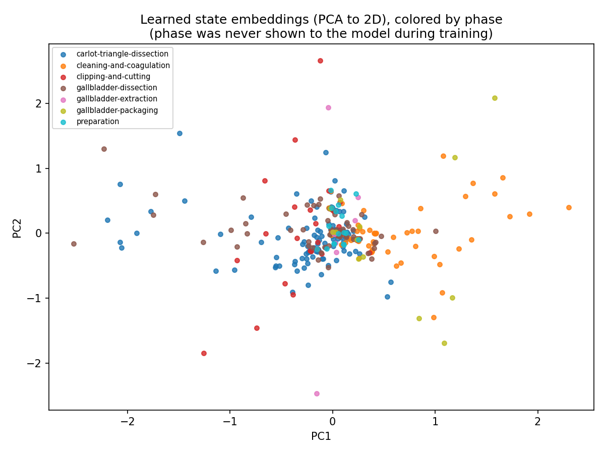

# Day16: State Embedding from Scratch

## Objective

Day13-15 closed out the symbolic Markov-chain line of investigation: a
count table mapping "current triplet-state -> most likely next
triplet-state" tops out at 34.5% next-state accuracy, and more history or
smarter smoothing has little room left to improve, because the ceiling is
set by what the triplet-state representation can express.

The roadmap's next step is representation learning: embeddings, then
sequence models with more memory (RNN), then Attention. The goal from here
on is not to beat 34.5% -- it is to understand the *mechanism* of an
embedding, using this dataset as pedagogical material. Today replaces the
Markov count table with a small neural network (an embedding lookup +
linear layer + softmax) trained by hand with numpy, and asks: does a model
forced to compress 358 discrete states into a 16-number vector, trained
only to predict the next state, spontaneously rediscover phase-level
(macro) structure -- without ever being given phase labels?

## Method

[`state_embedding.py`](state_embedding.py) reuses Day14's exact state
segmentation, vocabulary, and train/test split (same 50 videos, same
`random.seed(42)`), so results are directly comparable to Day14's Markov
table.

Instead of counting transitions directly, it trains:

```
embedding = E[current_state_id]        # (16,) lookup row
logits    = W @ embedding + b          # (358,)
probs     = softmax(logits)
```

`E` is a (358, 16) embedding table -- the same idea as a word embedding,
except the "words" are surgical triplet-states. There is no
autograd: the forward pass, cross-entropy loss, and backward pass
(gradients for `E`, `W`, `b`) are all written out explicitly and updated
with plain mini-batch SGD (150 epochs, batch size 64, learning rate 0.1),
so every step of backpropagation is visible in the code.

Phase labels are tracked alongside the triplet-states purely for
visualization -- majority-vote phase per state segment, per video -- and
never enter training. After training, the (358, 16) embedding table is
projected to 2D with plain SVD-based PCA (no sklearn) and colored by each
state's dominant phase, to check whether phase structure emerges anyway.

## Results

| Model | N (test) | Accuracy | Baseline |
|---|---:|---:|---:|
| Markov count table (Day14) | 1423 | 0.345 | 0.121 |
| Embedding model, all test transitions | 1423 | 0.339 | 0.121 |
| Embedding model, states seen in training only | 1364 | 0.352 | -- |

59 of the 1423 test transitions start from a state that never appeared as
a "current state" during training. The Markov table simply has no entry
for these (excluded from its accuracy). The embedding model has no such
option -- every state has a row in `E`, even ones never updated during
training -- so it always produces some prediction, right or wrong, from
that state's still-near-random initial embedding.



## Interpretation

**On accuracy:** the embedding model (35.2% on states seen in training)
matches the Markov table (34.5%) almost exactly. This is expected, not
surprising: a bigram-style next-state prediction task has a hard
information ceiling set by the data itself (Day15's conclusion), and a
large enough embedding + linear layer can represent an arbitrary lookup
table. The neural version does not fail, but it also does not unlock
anything the count table couldn't already reach for *this* task.

**On structure:** the PCA plot does not show clean phase clusters. There
is a dense core where most states from all phases overlap, plus a looser
scatter of states pulled to the periphery. Looking closely, there is a
weak directional trend -- `carlot-triangle-dissection` (blue) states drift
toward the upper-left, `cleaning-and-coagulation` (orange) states drift
toward the lower-right -- but it is a gradient, not a separation, and
`gallbladder-dissection` (brown) is scattered across most of the space.

The reason is straightforward once stated: the training objective only
asks "what triplet-state comes next, one step from now." Nothing in that
objective rewards the model for encoding *which phase this state belongs
to* -- phase is a slow-changing, procedure-level property, while the
prediction target is a fast, local one. Two states can have very
different dominant phases but nearly identical next-state distributions
(e.g. a generic grasping state appears in several phases), so the
objective pulls them together regardless of phase. An embedding only
captures the structure its training signal actually rewards; it does not
discover arbitrary structure in the data for free.

## Reflection

The instinct going in was "embeddings surface hidden structure" -- and
that is true, but only structure relevant to the loss the model is
actually trained on. This run's loss is next-state prediction, which is a
local, short-horizon signal; phase is a global, long-horizon one. Getting
an embedding that separates by phase would require a training signal that
actually depends on phase-scale context -- exactly the kind of longer
memory an RNN (Day17+) is meant to bring, by carrying information forward
across many states instead of only the immediately preceding one.

This also reframes what "Day13-15 closed out the Markov-chain
investigation" meant: it wasn't just that counting transitions is
inflexible, it's that *a one-step-back prediction objective* is inflexible,
regardless of whether it's implemented as a count table or a neural
network. Moving to RNN/Attention is a change in the training signal's
effective memory, not primarily a change in model type.

## Conclusion

A from-scratch embedding model matches the Markov table's accuracy almost
exactly and does not spontaneously discover phase structure, because
phase was never part of what it was asked to predict. This sets up the
next step precisely: Day17 moves from a one-step Markov-style objective to
an RNN that carries state across a whole sequence, to see whether a
longer-memory objective changes what the learned representation captures.
