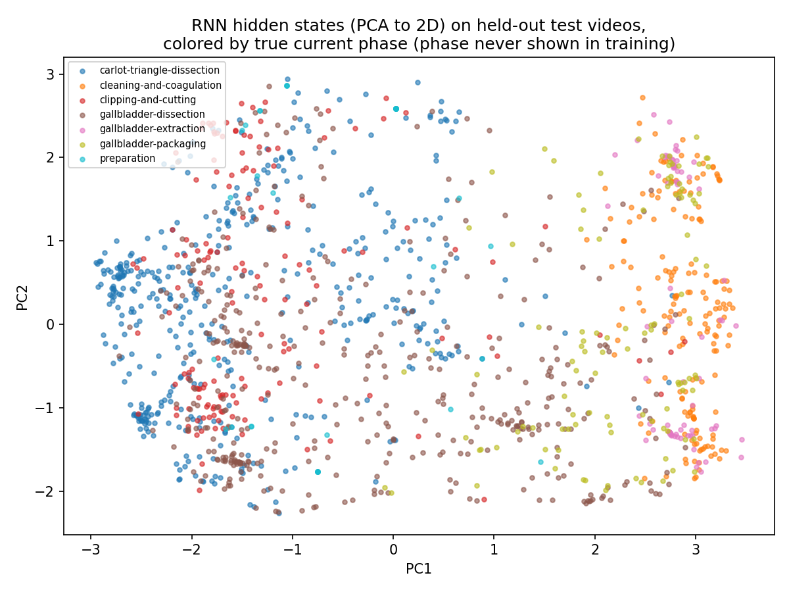

# Day17: State RNN from Scratch

## Objective

Day16's conclusion was specific: an embedding model conditioned only on
the *current* triplet-state matches the Markov table's accuracy (~35%)
and does not spontaneously encode surgical phase, because a one-step-back
objective never rewards phase-scale (procedure-level) structure. The
reflection proposed a concrete next test: a model that carries
information across the *whole* sequence, not just the current state,
should have a training signal that can depend on phase-scale context. An
RNN is exactly that: a hidden vector `h_t` updated at every step, in
principle able to summarize everything seen since frame 0 of the video.

Today implements a plain (Elman) RNN by hand with numpy -- forward pass,
full backpropagation through time (BPTT), and SGD updates, no autograd --
and asks two questions: (1) does having access to the full history beat
the ~35% one-step ceiling, and (2) do the RNN's hidden states, unlike
Day16's static embeddings, separate by phase even though phase is still
never part of training?

## Method

[`state_rnn.py`](state_rnn.py) reuses the same 50-video state
segmentation, vocabulary, and train/test split as Day14/16.

```
x_t    = E[state_t]                            # (16,)  embedding lookup
h_t    = tanh(Wxh @ x_t + Whh @ h_{t-1} + bh)   # (32,)  recurrent update
logits = Why @ h_t + by                         # (358,)
probs  = softmax(logits)
```

`h_t` is reset to zero only at the start of each video and carried
forward across the entire sequence, so `h_t` is a function of every state
the video has passed through so far -- not just `state_t`. Training uses
full BPTT per video (forward pass through the whole sequence, then
backward pass accumulating gradients for `E`, `Wxh`, `Whh`, `bh`, `Why`,
`by` at every step), followed by plain SGD with gradient clipping
(`[-5, 5]` per element -- a standard practical safeguard against
exploding gradients in RNNs).

## A failure worth keeping: mode collapse from a too-small init

The first version initialized every weight matrix as
`np.random.randn(...) * 0.01`, matching Day16's embedding model. Training
loss dropped smoothly (5.86 -> 3.85 over 20 epochs) but test accuracy
never moved from the 12.1% baseline -- the model was predicting the exact
same single state for every one of the 1423 test transitions, regardless
of input. More epochs and a higher learning rate did not fix it (100
epochs, 4x the learning rate: still 12.4%, indistinguishable from
baseline).

The cause: with every weight matrix started at a tiny scale, `h_t` stays
extremely close to zero for a long time, since `tanh` of a near-zero
input is itself near zero. When `h_t ~ 0`, the gradient of the loss with
respect to `Wxh`, `Whh`, and `E` is *also* proportional to values derived
from `h_t` -- so it stays near zero too, and those matrices barely move.
Only the output bias `by` (which doesn't depend on `h_t` at all) receives
a usable gradient, so it alone converges toward the log of the
unconditional next-state frequency. The model quietly settles into
"ignore the input, always predict the most common class" -- a valid local
optimum of the loss, just not an interesting one.

The fix was standard Xavier-style initialization -- scaling each matrix
by `1/sqrt(fan_in)` instead of a small fixed constant -- so that `h_t`
starts with enough spread for gradients to actually reach `Wxh`, `Whh`,
and `E`. This is kept in the final script (see `state_rnn.py`) rather
than papered over, because the failure mode -- and recognizing it from
"loss falls, but accuracy is stuck at baseline" rather than assuming the
model is broken -- is as much the lesson of the day as the result below.

## Results

| Model | N (test) | Accuracy | Baseline |
|---|---:|---:|---:|
| Markov count table (Day14) | 1423 | 0.345 | 0.121 |
| Embedding model (Day16, seen states) | 1364 | 0.352 | -- |
| RNN (full history) | 1423 | **0.405** | 0.121 |



**Linear probe (quantifying the PCA plot):** the plot above is a 2D
projection of a 32-dim hidden space -- suggestive, but not proof of how
much phase information is really encoded. [`phase_linear_probe.py`](phase_linear_probe.py)
checks this directly: freeze the trained RNN completely (no gradient
flows into `E`/`Wxh`/`Whh`/`Why`/`by` from here on), then fit the
simplest possible classifier -- one linear layer + softmax, trained with
the same from-scratch gradient descent as everywhere else in this
project -- on top of the frozen hidden states, to predict phase (7
classes) on the same held-out test videos.

| | N (test) | Accuracy | Baseline |
|---|---:|---:|---:|
| Linear probe (phase from frozen `h_t`) | 1423 | **0.684** | 0.292 |

A single linear layer recovers phase more than twice as often as the
majority-class baseline, directly from a hidden state that was never
trained to predict phase. This is a stronger, more quantitative version of
what the PCA plot suggested: phase is substantially linearly readable
from the RNN's hidden state, not merely eyeball-visible in a 2D
projection.

## Interpretation

**On accuracy:** the RNN clears the ~35% ceiling that both the Markov
table and the static embedding model shared, reaching 40.5%. This is
consistent with the diagnosis from Day15/16: that ceiling was a property
of *one-step-back* prediction, not of triplet-states as a representation.
Given access to the states that came before the current one, the model
finds extra predictive signal that a single previous state cannot supply
by itself.

**On structure:** the hidden-state plot is qualitatively different from
Day16's. Rather than one dense, phase-mixed core, there are visible
phase-coherent regions, and their layout roughly tracks surgical order:
`carlot-triangle-dissection` (blue) and `clipping-and-cutting` (red) --
early phases -- occupy the left side, while `cleaning-and-coagulation`,
`gallbladder-extraction`, and `gallbladder-packaging` -- later phases --
cluster together on the right. `gallbladder-dissection` (brown), the
longest and most heterogeneous phase, is spread more broadly, consistent
with it covering the widest range of sub-activities.

This is the direct confirmation of Day16's hypothesis: once the training
signal depends on more than the immediately preceding state, the model's
internal representation organizes itself along a procedure-scale axis --
without phase ever being a labeled target. The RNN did not learn "this is
phase X"; it learned whatever history-dependent regularities best predict
the next state, and those regularities happen to align with phase because
phase order is exactly the kind of long-range structure Day15 identified
as governing this procedure.

## Reflection

The mode-collapse failure is a good concrete answer to "why does everyone
say RNNs are hard to train": it is not that the update rule (BPTT + SGD)
is exotic, it is that a bad initialization can put the model in a region
of parameter space where gradients to the recurrent weights vanish
early, and a *worse*-looking-but-stable loss curve (smoothly decreasing)
can mask that nothing useful is being learned. "Loss went down" is not by
itself evidence a model is learning the intended thing -- checking
accuracy, or in general checking the metric that actually matters,
caught what the loss curve alone did not.

On the result itself: this was the first day since starting the
Markov-chain line of investigation (Day13) where next-state accuracy
moved meaningfully past ~35%. It came from changing what information the
model has access to (full history vs. one previous state), not from a
bigger or fancier model applied to the same information -- a useful
distinction to carry forward into Attention, where the mechanism for
accessing history changes again (a weighted combination over all past
states, rather than a single compressed hidden vector).

## Conclusion

An RNN carrying hidden state across a full video reaches 40.5% next-state
accuracy (vs. ~35% for both the Markov table and Day16's embedding
model), and its hidden states visibly organize by surgical phase despite
phase never being a training target -- confirming that the ~35% ceiling
was specific to one-step-back prediction, not to the triplet-state
representation itself. Day18 moves to Attention, to examine a different
mechanism for using history: instead of compressing the whole past into
one fixed-size hidden vector updated step by step, an attention
mechanism can look back and weigh specific earlier states directly.
