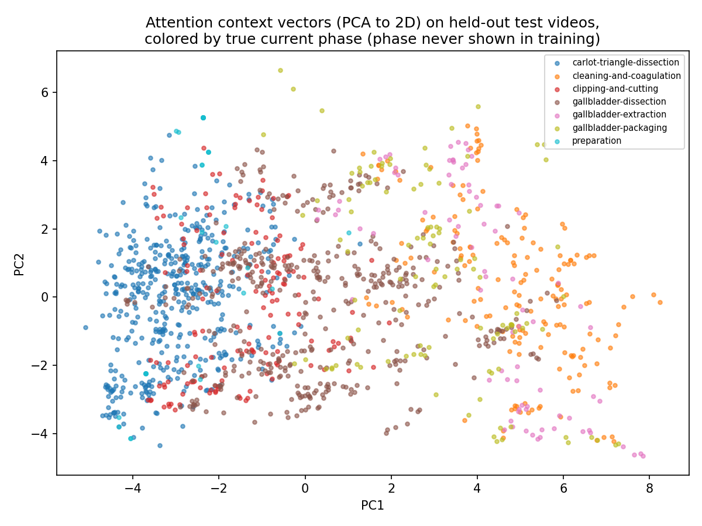

# Day18: State Attention from Scratch

## Objective

Day17's RNN cleared the ~35% ceiling shared by the Markov table and
Day16's embedding model by carrying a hidden vector across an entire
video, reaching 40.5% next-state accuracy, and its hidden states turned
out to be substantially phase-decodable (68.4% via a linear probe) even
though phase was never a training target.

The roadmap's next mechanism is Attention. The key structural difference
from an RNN is not "more memory" -- an RNN already has access, in
principle, to the whole past, compressed into one fixed-size vector
updated step by step. The difference is *how* history is accessed: an
RNN must squeeze everything into that one vector as it goes, discarding
whatever it doesn't carry forward, whereas self-attention keeps every
past position separately available and lets the model look back and
weigh specific earlier positions directly, computed in one shot rather
than one step at a time. Today implements causal self-attention entirely
from scratch (forward pass, softmax-over-scores backward, no autograd)
and asks whether this different access pattern changes accuracy or the
learned structure -- and, as a specific mechanical point, what role
positional encoding plays, since attention (unlike an RNN) has no
built-in sense of order.

## Method

[`state_attention.py`](state_attention.py) reuses the same 50-video state
segmentation, vocabulary, and train/test split as Day14/16/17.

```
Xp = E[state] + positional_encoding[position]     # (n, 16)
Q, K, V = Xp @ Wq, Xp @ Wk, Xp @ Wv                # (n, 16) each
scores[t, s] = (Q[t] . K[s]) / sqrt(16)            # for s <= t, else -inf
weights[t, :] = softmax(scores[t, :])
context[t]    = sum_s weights[t, s] * V[s]
logits[t]     = context[t] @ Why.T + by
```

There is no recurrence: `context[t]` is a direct weighted combination of
every earlier position's value vector, with the weights determined by a
learned query-key compatibility score (this is standard scaled
dot-product self-attention, single-head, causally masked so position `t`
can only look at `s <= t` -- the same "predict state t+1 from information
available up to t" setup as every previous day). Positional encoding is
the fixed sinusoidal scheme from Vaswani et al. (2017): no learned
parameters, just a fixed pattern added to each state's embedding before
attention, so the model has some way to tell "this state occurred early"
from "this state occurred late" -- information an RNN gets for free from
simply processing the sequence in order.

Forward pass, backward pass (through the softmax over attention scores,
the causal mask, and the three projection matrices `Wq`/`Wk`/`Wv`), and
SGD updates are all written out explicitly in the script.

## Results

| Model | N (test) | Accuracy |
|---|---:|---:|
| Markov count table (Day14) | 1423 | 0.345 |
| Embedding model (Day16, seen states) | 1364 | 0.352 |
| RNN (Day17) | 1423 | 0.405 |
| Attention, with positional encoding | 1423 | 0.331 |
| Attention, without positional encoding | 1423 | 0.280 |

This single-layer attention model does not beat the RNN, and with
positional encoding removed, it falls below the Markov table too. See
Interpretation for why this is not a contradiction of "attention is a
powerful mechanism" -- it is a specific, honest result about this
particular minimal implementation.

**Phase structure -- PCA of context vectors:**

| | image |
|---|---|
| With positional encoding |  |

With positional encoding, the context vectors lay out along a single
axis that closely tracks surgical order: `preparation` /
`carlot-triangle-dissection` on one end, `cleaning-and-coagulation` /
`gallbladder-extraction` / `gallbladder-packaging` on the other --
visually the cleanest phase gradient of any day so far.

**Linear probe -- quantifying how much of that is positional encoding
versus content-based attention** ([`phase_linear_probe.py`](phase_linear_probe.py),
same frozen-features + linear-layer method as Day17):

| Variant | Probe accuracy | Baseline |
|---|---:|---:|
| With positional encoding | 0.653 | 0.292 |
| Without positional encoding | 0.467 | 0.292 |
| (Day17 RNN, for reference) | 0.684 | 0.292 |

## Interpretation

**On accuracy:** this vanilla single-head attention layer underperforms
the RNN, and underperforms the Markov table once positional encoding is
removed. The likely reason is architectural, not about attention as a
concept: this implementation is *only* a weighted average of value
vectors -- there is no nonlinearity applied after combining them, no
multiple heads attending to different kinds of relationships at once, no
position-wise feed-forward layer, and no stacking of layers. An RNN, by
contrast, applies a `tanh` nonlinearity at *every single step*, repeatedly
transforming its running summary as it goes. For a small vocabulary
(358 states) and modest data, that repeated nonlinear transformation
turns out to matter more than direct positional addressability. This is
exactly the gap that a full Transformer block (multi-head attention +
feed-forward network + residual connections + layer norm, stacked)
exists to close -- today's result is evidence for *why* those extra
pieces are there, not a demonstration that attention underperforms
recurrence in general.

**On positional encoding:** removing it drops next-state accuracy
(0.331 -> 0.280) and drops the phase-probe accuracy sharply (0.653 ->
0.467). This confirms two things at once. First, mechanically: unlike an
RNN, whose recurrence makes position implicit (there's no way to feed it
the same states in shuffled order without changing every hidden state
computed afterward), self-attention has no inherent sense of order --
without positional encoding, attention over a shuffled state sequence
would produce identical attention scores for the same *set* of past
states regardless of what order they occurred in. Second, empirically:
a meaningful part of the clean phase gradient seen with positional
encoding is coming from absolute position leaking into every context
vector, not purely from the model learning to attend to
phase-informative past states -- because surgical phases in this dataset
proceed in a roughly fixed clinical order, "early in the video" and
"probably still in an early phase" are strongly correlated, so position
alone is a real, if crude, phase signal. That said, the without-PE probe
(0.467) is still far above baseline (0.292) and above Day16's
context-free embedding model's implied ceiling, so content-based
attention over past *states* -- with no position information at all --
is doing real work too, just less than position does by itself here.

## Addendum: does next-state prediction even need long context?

Given how local most next-state decisions plausibly are (switch traction
direction, pause and reassess, reach for suction after bleeding), it's
worth asking directly whether Day17's RNN accuracy gain (40.5% vs. ~35%)
actually required long-range history at all, or whether a short window of
recent states would have gotten the same result -- in which case Attention
and RNN's whole-history machinery would be solving a problem this task
doesn't really have. [`window_size_comparison.py`](window_size_comparison.py)
tests this directly with three methods at window sizes k = 1, 2, 3, 5, 10:
a k-th order Markov table (pure counting, no learning), an RNN with its
hidden state reset every k steps (bounding how much history can survive),
and attention with its causal mask additionally restricted to the last k
positions (an exact sliding window, no reset approximation needed).

| Method | k=1 | k=2 | k=3 | k=5 | k=10 | Full history |
|---|---:|---:|---:|---:|---:|---:|
| k-th order Markov | 0.345 | 0.382 | 0.301 | 0.124 | 0.005 | -- |
| Windowed RNN | 0.337 | 0.353 | 0.318 | 0.313 | 0.348 | 0.405 |
| Windowed attention | 0.332 | 0.284 | 0.339 | 0.327 | 0.329 | 0.331 |

Three distinct findings, each answering a different part of the question:

**The Markov table shows why raw counting can't use long context at all.**
Accuracy briefly improves from k=1 to k=2 (0.345 -> 0.382), then collapses
at k=3 (0.301), k=5 (0.124), and k=10 (0.005). Every increase in k
multiplies the number of *distinct* contexts a table must have seen
verbatim to make a prediction, while the training data (6631 transitions
from 40 videos) stays fixed -- so most k=10 contexts in the test set were
simply never seen in training, and the table has nothing to say. This is
the concrete version of the motivation behind Day16's move to embeddings:
a method that requires exact context matches cannot scale to longer
history, no matter how useful that history might be in principle.

**The windowed RNN does not reach the full-history RNN at any tested k.**
Accuracy is flat and noisy across k=1 to k=10 (0.313-0.353), with no
clear upward trend -- even k=10, a substantial fraction of an average
~166-state video, falls 5-9 points short of the full-history result
(0.405). If the RNN's edge over the Markov/embedding baseline came from
"a handful of recent states," a window of 10 should have captured most of
it. It didn't. This points back to Day17's phase-decoding result:
whatever the RNN gains beyond the short-context floor looks like a
slowly-accumulated sense of *how far into the procedure this video is* --
a genuinely long-range signal, not a local one, and one that a bounded
window of even 10 states does not yet reveal.

**Windowed attention is flat everywhere, including at full history.**
0.284-0.339 across every k, with the "full history" number (0.331)
indistinguishable from the rest. This model does not exploit additional
context at *any* length, short or long -- consistent with the main
finding above that this attention implementation's ceiling is an
architectural one (no nonlinearity, single head, no depth), not a
context-length one. Longer context isn't refused for lack of information;
it's refused because this particular function can't make use of it.

So the original intuition -- "next-S prediction is mostly a short-horizon
problem" -- is half right and half in need of revision. A short window
already reaches the ~30-35% floor shared by the Markov table, the
embedding model, and every windowed variant here, which suggests the bulk
of next-state predictability really is local. But the RNN's extra margin
above that floor is *not* reproduced by any tested short window -- it
specifically required something close to the full video, which matches a
slow-moving "procedure progress" signal much better than a "last few
actions" signal. Attention, meanwhile, never captured that margin at any
window length, so its problem in this implementation is capacity, not
context.

## Reflection

Today's most useful result is negative: a plain, single-layer,
single-head attention mechanism is not automatically better than an RNN.
Attention's real architectural advantage -- direct, parallel access to
every past position, rather than a serial bottleneck through one hidden
vector -- is a capability that pays off once it's combined with the rest
of a Transformer block (multiple heads to attend to different kinds of
relationships simultaneously, a feed-forward network to add nonlinear
processing after attending, residual connections and normalization to
make stacking many such blocks trainable). Judged in isolation, on a
small vocabulary and a few thousand training transitions, the mechanism
this project has built so far is a strictly simpler function than an
RNN's repeated nonlinear update, and it performs like one.

The positional-encoding ablation is the cleaner lesson of the day:
whenever a model shows a result that looks like "it understood
procedure structure," it's worth asking what cheaper signal could
produce the same picture. Here, a large part of the answer was "it knows
roughly how far into the video it is, and phase correlates with that" --
a real signal, but a much less interesting one than "it learned which
earlier surgical states are relevant to attend to." Both were present
(0.467 probe accuracy without any position information at all is not
nothing), but conflating them would have overstated what attention alone
had discovered.

## Conclusion

A minimal causal self-attention layer reaches 33.1% next-state accuracy
with positional encoding (28.0% without) -- below Day17's RNN (40.5%) and,
without positional encoding, below the original Markov table (34.5%).
Positional encoding measurably contributes to both accuracy and the
phase structure visible in context vectors, and a probe isolates
content-based attention's own contribution to phase structure (46.7%) as
real but smaller than position's. This sets up Day19 precisely: the
missing pieces are not "more attention" but the rest of the Transformer
block -- multi-head attention, a feed-forward network, and residual/
normalization that make stacking multiple such blocks trainable -- to see
whether that combination is what finally surpasses the RNN, rather than
attention alone.

The window-size addendum adds a separate, converging line of evidence
for a limitation this project keeps running into since Day15: triplet-
states and phase labels are running out of room to express what actually
drives a surgeon's next action. Murali et al.'s *Encoding Surgical Videos as Latent Spatiotemporal Graphs
for Object and Anatomy-Driven Reasoning* (2023, arXiv:2312.06829) moves
past instrument-verb-target triplets
entirely, representing a surgical video as a graph over detected objects
and anatomical structures evolving in time. Given today's results --
longer context helps only up to a point no representation-preserving
model here could push past, and what *does* help looks like a coarse
"how far along" signal rather than fine-grained understanding -- building
richer graph nodes (anatomy, individual instruments, their spatial
relations) rather than reaching for a bigger sequence model looks like
the more load-bearing move. This project's sequence models (Day16-18)
have been asking "how much can be squeezed out of a fixed, coarse
representation with more history and better mechanisms"; that paper asks
a different, likely more consequential question: "what if the
representation itself carried more of the right information."
