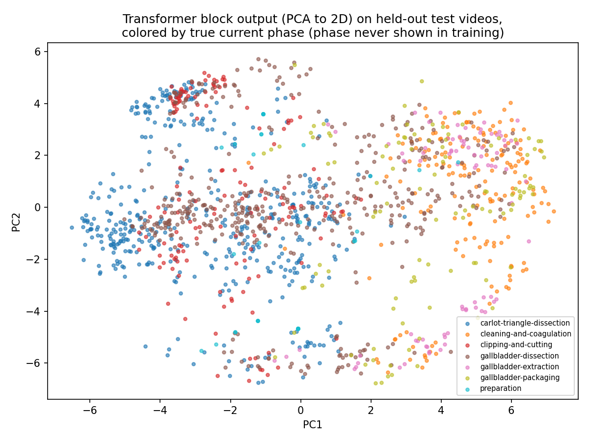

# Day19: Transformer Block from Scratch

## Objective

Day18's plain causal self-attention -- a weighted average of value
vectors, nothing else -- underperformed Day17's RNN (33.1% vs. 40.5%) and,
without positional encoding, even underperformed the original Markov
table. The interpretation was architectural: that implementation had no
nonlinearity after attending, only one head, and no depth. Today
implements a real Transformer (decoder) block -- multi-head attention,
a position-wise feed-forward network, and residual connections with
Layer Normalization around both sublayers -- entirely from scratch, to
test whether closing those specific gaps changes the outcome.

## Method

[`transformer_block.py`](transformer_block.py) reuses the same 50-video
state segmentation, vocabulary, and train/test split as
Day14/16/17/18. One block:

```
MHA_out = MultiHeadAttention(Xp)              # 4 heads, 8 dims each
Z1      = LayerNorm(Xp + MHA_out)             # residual + norm
FFN_out = Linear2(ReLU(Linear1(Z1)))          # 32 -> 64 -> 32
Z2      = LayerNorm(Z1 + FFN_out)             # residual + norm
logits  = Z2 @ Why.T + by
```

Multi-head attention runs 4 independent scaled dot-product attention
computations (as in Day18, causally masked, with the same sinusoidal
positional encoding) in parallel 8-dimensional subspaces, concatenates
their outputs, and mixes them with a learned output projection `Wo` --
letting the model attend to several different kinds of relationships at
once instead of one shared pattern. The feed-forward network is the
nonlinearity Day18 lacked entirely: a two-layer MLP with a ReLU, applied
independently to every position. Layer Normalization (normalize each
position's vector to zero mean / unit variance, then apply a learned
scale and shift) around each sublayer, combined with the residual
("skip") connections, is what makes it practical to have this much
depth and nonlinearity without the vanishing/exploding-gradient
difficulties that showed up as flat-out mode collapse in Day17.

Forward pass and a full manual backward pass (through both
LayerNorms, the feed-forward network, and multi-head attention) are
written out with no autograd. Before running on real data, the backward
pass was checked against numerical gradients (finite differences) on a
small synthetic example (5 positions, 8 dimensions, 2 heads) -- every
parameter's analytic gradient matched its numerical estimate to within
~1e-5 relative error, which is the standard way to catch a wrong sign or
a mismatched shape in a hand-derived backward pass before trusting it on
real data.

## A second failure worth keeping: overfitting with more capacity

The first full run (40 epochs, matching Day17's RNN schedule) reached
35.3% test accuracy, with training loss still visibly decreasing. Naively
concluding "train longer" and rerunning at 100 epochs dropped training
loss much further (2.28 -> 1.54) but test accuracy *fell* to 28.4% --
worse than 40 epochs, and worse than Day18's plain attention. Checking
accuracy every 10 epochs shows what happened:

| Epoch | Train loss | Test accuracy |
|---:|---:|---:|
| 10 | 3.26 | 0.206 |
| 20 | 2.78 | 0.327 |
| 30 | 2.46 | 0.353 |
| 40 | 2.28 | 0.353 |
| 50 | 2.12 | 0.349 |
| 60 | 1.98 | 0.342 |
| 70 | 1.86 | 0.341 |
| 80 | 1.76 | 0.356 |
| 90 | 1.67 | 0.339 |
| 100 | 1.54 | 0.284 |

Test accuracy plateaus around epoch 30-40, stays roughly flat with some
noise through epoch 90, then drops sharply by epoch 100 -- while training
loss keeps falling the entire time. This is textbook overfitting: with
358 output classes, a 32-dimensional embedding, 4 attention heads, and a
64-unit feed-forward layer, this block has enough capacity to start
fitting quirks specific to the 40 training videos rather than the
general transition structure, once given enough epochs to do so. The
tracked script keeps 40 epochs (the plateau region), and this table is
kept as documentation of *why* -- not because 40 was tuned to produce a
good headline number, but because the alternative (train longer, get a
lower loss) was checked and found to make the model worse, mirroring
Day17's lesson that a falling loss curve is not by itself proof of
useful learning.

## Results

| Model | N (test) | Accuracy |
|---|---:|---:|
| Markov count table (Day14) | 1423 | 0.345 |
| Embedding model (Day16, seen states) | 1364 | 0.352 |
| RNN (Day17) | 1423 | **0.405** |
| Attention, with positional encoding (Day18) | 1423 | 0.331 |
| Attention, without positional encoding (Day18) | 1423 | 0.280 |
| Transformer block (Day19) | 1423 | 0.353 |

The Transformer block closes most of the gap that plain attention had
relative to the Markov table and embedding model (0.331 -> 0.353), but
still falls short of the RNN (0.405).

**Linear probe** ([`phase_linear_probe.py`](phase_linear_probe.py), same
frozen-features + linear-layer method as Day17/18):

| Model | Probe accuracy | Baseline |
|---|---:|---:|
| RNN hidden state (Day17) | 0.684 | 0.292 |
| Attention context, with PE (Day18) | 0.653 | 0.292 |
| Transformer block output (Day19) | **0.685** | 0.292 |



## Interpretation

**On accuracy:** adding multi-head attention, a feed-forward network, and
residual/LayerNorm closed most (though not all) of the gap between plain
attention and the other methods. This supports Day18's diagnosis: a bare
attention layer's weakness was capacity (no nonlinearity, one head, no
depth), and adding that capacity back recovers most of the lost ground.
It still doesn't beat the RNN.

**On the probe vs. accuracy split -- the most interesting result of the
day:** the Transformer block's output is *just as* phase-decodable as the
RNN's hidden state (0.685 vs. 0.684 -- effectively tied), yet its
next-state accuracy is meaningfully lower (0.353 vs. 0.405). This
separates two things that looked like they were moving together in
Day17-18: "does this representation know roughly what part of the
procedure it's in" and "can it predict the exact next state." The
Transformer block answers the first question just as well as the RNN,
but is worse at the second. A plausible reason: the RNN's hidden state is
built by *repeatedly* applying the same nonlinear transformation, once
per state, compounding a running summary step by step -- which may track
fine-grained, recent-state-dependent dynamics (what specifically just
happened, one or two states ago) more precisely than a single block of
global attention averaged across an entire, potentially long, video.
Coarse position-in-procedure and fine local dynamics are both real
signals in this data, and this experiment suggests the two mechanisms
are not equally good at capturing both at once.

## Reflection

Stepping back across all four mechanisms (Day16-19), the most important
reflection is about the roadmap itself, not any single day's result. The
motivating idea at Day15/16 was that a one-step-back objective might be
the limiting factor, and that giving a model access to more context --
embeddings, then an RNN's full running summary, then attention's direct
access to every past position, then a full Transformer block -- should
progressively unlock more predictive power. In practice, next-state
accuracy moved from 34.5% (Markov, k=1) to a ceiling that never exceeded
~40% (the RNN, still the best of the four), regardless of how much more
sophisticated the context-handling mechanism became. Day18's window-size
study already showed short context reaches most of this range on its own;
today's result adds that even a full Transformer block, with a
correctness-verified implementation and genuine multi-head/nonlinear
capacity, does not move the ceiling higher, and in one clean respect (raw
accuracy) sits behind the much simpler RNN. Taken together, this is
reasonably strong evidence that "predict the exact next triplet-state"
is a task whose achievable accuracy is set mostly by what a triplet-state
can express and by the local, short-horizon nature of most surgical
micro-decisions -- not by how much historical context or architectural
sophistication is thrown at it. More context helped a little (Markov to
RNN), more architecture helped recover some lost ground (attention to
Transformer) but not exceed what recurrence already found. Neither
scaled the way the roadmap first assumed it would.

Two narrower lessons stand out as well. First, methodologically: hand-deriving backward
passes through LayerNorm and multi-head attention is exactly the kind of
place a sign error or transposed matrix hides silently -- the loss can
still go down even with a subtly wrong gradient, especially early in
training when most gradients are small and noisy. Verifying against
numerical gradients on a tiny synthetic example first, before trusting
any result on real data, is now something to reach for by default when
implementing a new backward pass from scratch, not just when something
looks obviously broken (Day17's mode collapse was at least visibly wrong;
a subtly incorrect LayerNorm gradient might not have been).

Second, on the architecture itself: more capacity is not free, and this
project's dataset (40 training videos, ~6600 transitions, 358 classes) is
small enough that a full Transformer block can overfit within the same
number of epochs that were exactly right for Day17's RNN. "Which model is
better" depends on being honest about how much each one has actually
converged versus started memorizing -- a comparison at a single fixed
epoch count is only fair if that epoch count is actually near each
model's own best point, which is why the epoch-sweep table above matters
as much as the headline number.

## Conclusion

A single Transformer block reaches 35.3% next-state accuracy -- better
than plain attention (33.1%) but still short of the RNN (40.5%) -- while
matching the RNN's ability to linearly encode surgical phase (0.685 vs.
0.684) almost exactly. This suggests the remaining gap to the RNN is not
about *whether* the model understands where it is in the procedure (both
do, equally well), but about capturing finer, more local sequential
dynamics that repeated recurrent updates seem to track more precisely
than one pass of global attention. Documented alongside this is a second
from-scratch-implementation lesson: a numerically-verified backward pass
is worth the extra step before trusting a result, and more model capacity
on a small dataset needs to be checked against overfitting, not assumed
to help by default. This closes out the embedding -> RNN -> Attention ->
Transformer roadmap set at Day15; the running conclusion across all four
mechanisms remains that triplet-state and phase-label representations
have a ceiling no amount of architecture change here has broken through,
which is the same conclusion that motivates richer, anatomy-aware
representations like Murali et al.'s spatiotemporal graphs (see Day18).
