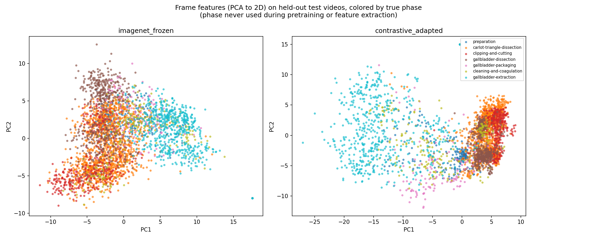

# Day32: What's Inside the Contrastively-Learned Representation?

## Objective

Day31's contrastive pretext task never used temporal order or any
label: it only ever compared two augmented views of the *same* frame
against other frames, treated as interchangeable negatives regardless
of which video or moment they came from. Day31's instrument linear
probe showed the resulting features are more useful than plain frozen
ImageNet features for instrument recognition (macro F1 0.302 -> 0.407),
but that result doesn't say what the representation organizes itself
around. Today reuses the exact methodology from Day16-19 (linear probe
+ PCA visualization) -- there applied to a symbolic sequence model's
hidden state, here applied to a real visual backbone -- to ask directly:
does surgical **phase** structure (7 classes, CholecT50's own
procedure-stage labels) show up in the contrastively-adapted features,
even though phase was never a training target and the pretext task had
no temporal signal at all? And does it show up more than in plain
frozen ImageNet features?

## Method

[`representation_analysis.py`](representation_analysis.py) extracts
features from two backbones -- plain frozen ImageNet (Day21's setup, no
adaptation) and Day31's contrastively-adapted one -- for the same 10
videos and video-level 8/2 split used throughout. For each, a linear
probe (single softmax layer, trained from scratch with plain gradient
descent, same method as Day17/19) is trained on the 8 training videos'
features to predict phase, and evaluated on the 2 held-out test videos'
features. Both variants' test-set features are also projected to 2D via
plain SVD-based PCA (no sklearn, same convention as every prior
visualization) and colored by true phase for a qualitative comparison.

## Results

| Variant | Phase-probe accuracy | Baseline |
|---|---:|---:|
| ImageNet frozen (no adaptation) | 0.511 | 0.382 |
| Contrastively adapted (Day31) | **0.532** | 0.382 |

## Interpretation

**Both variants already encode substantial phase structure**, well
above the majority-class baseline (0.382) -- confirming that phase is
correlated with generic visual statistics (which instruments are
visible, which anatomical structures are exposed) strongly enough that
even unmodified ImageNet features pick up a lot of it "for free."
Contrastive adaptation adds a real but modest further improvement (0.511
-> 0.532, roughly a 4% relative gain) -- much smaller than the jump
contrastive adaptation gave instrument recognition in Day31 (0.302 ->
0.407, a 35% relative gain). This makes sense: there was much less room
to improve on phase, since generic features were already fairly good at
it, unlike several individual instruments (clipper, bipolar) where
frozen ImageNet features were nearly non-functional.

**The PCA plot shows a specific, interpretable change, not just a
diffuse improvement.** Under frozen ImageNet features (left panel),
colors are heavily intermixed throughout the point cloud, with only a
loose gradient (brown `gallbladder-dissection` upper-left, red
`clipping-and-cutting` lower-left, cyan `gallbladder-extraction` spread
right). Under contrastive adaptation (right panel), a tight, clearly
separated cluster appears on the right side, composed almost entirely of
`clipping-and-cutting` (red) with some `gallbladder-dissection` (brown)
nearby -- a much sharper separation than anything in the frozen version.
This lines up directly with Day31's per-instrument finding: `clipper`
was one of the instruments contrastive adaptation improved most
dramatically (F1 0.012 -> 0.298, closing 59.6% of the gap to supervised
fine-tuning), and `clipping-and-cutting` is exactly the phase where the
clipper is in near-constant use. The most visible structural change in
the representation coincides with the most dramatic instrument-level
improvement from the same day's other analysis -- consistent with the
same underlying mechanism (better separation of clipper-related visual
features) showing up in two independent probes.

## Reflection

This connects Day31 and Day32 into a single, coherent story rather than
two separate results: contrastive adaptation didn't uniformly sharpen
every kind of structure in the data, it sharpened the *specific* visual
distinctions it happened to improve (clipper's appearance), and that
improvement is visible both directly (Day31's instrument F1) and
indirectly, as a side effect, in an entirely different probe (Day32's
phase clustering) that was never the training target either. This is a
reassuring, non-trivial check: if the phase-clustering improvement had
appeared somewhere unrelated to Day31's instrument findings, it would be
harder to trust that either result reflects a real, specific mechanism
rather than a generic "training helped somehow" effect.

It's also a useful corrective to expecting self-supervised learning to
uniformly reveal hidden structure. Day17 found an RNN's hidden state
(with access to a full temporal sequence) organized clearly by phase
even though phase was never a target. Day32's contrastive backbone
(with access to zero temporal information, only a single static frame
per training example) shows a real but far more modest phase signal --
consistent with phase being partly a temporal/procedural concept that a
purely appearance-based, frame-independent pretext task has no
particular reason to capture well, similar to the same limitation
identified for verb recognition back in Day22 and Day25.

## Conclusion

Contrastive adaptation improves phase-probe accuracy modestly (0.511 ->
0.532), a much smaller relative gain than its effect on instrument
recognition (Day31: 0.302 -> 0.407) -- consistent with phase already
being substantially readable from generic visual features, leaving less
room to improve. The PCA visualization shows this modest aggregate gain
is not diffuse: a specific, sharply-separated cluster emerges for
`clipping-and-cutting`, the phase most tied to the clipper instrument --
the exact instrument contrastive adaptation improved most in Day31. Two
independent probes (an instrument classifier and a phase classifier,
neither trained during pretraining) point at the same underlying
mechanism, which is a stronger form of evidence than either result would
be alone.
