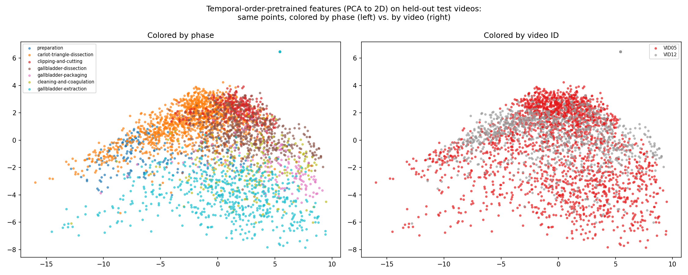

# Day34: Temporal-Order Self-Supervised Pretraining

## Objective

Day31-33's contrastive pretraining used zero temporal information: its
pretext task only ever compared two augmented views of the *same*
frame against other frames, treated as interchangeable negatives
regardless of which video or moment they came from. Day32 found this
captured only a modest amount of phase structure (linear-probe accuracy
0.511 -> 0.532) -- consistent with phase being partly a temporal/
procedural concept a frame-independent pretext task has no particular
reason to learn well. Today tries a genuinely different self-supervised
signal that *does* use temporal structure, still with zero labels: given
two frames from the same video, predict which one comes later in the
procedure (the classic "temporal order verification" family, e.g. Misra
et al.'s *Shuffle and Learn*, 2016, simplified to pairs). The hypothesis
going in: this should capture phase structure better than Day31's
appearance-only contrastive learning, since it directly supervises on
temporal position.

## Method

[`temporal_order_pretraining.py`](temporal_order_pretraining.py): same
backbone split as every prior SSL day (`conv1`-`layer3` frozen, `layer4`
trainable), same 8 training videos. A single linear "progress head"
maps each frame's 512-d backbone feature to one scalar. For a random
pair of frames from the same video, the head's scores are trained with
a pairwise ranking loss (`BCEWithLogitsLoss` on `score_later -
score_earlier`, RankNet-style) so that later frames get higher scores
than earlier ones. No instrument/verb/target/phase label is used
anywhere -- only each frame's own position in its video, which is not a
CholecT50 annotation, just an index.
[`linear_probe_evaluation.py`](linear_probe_evaluation.py) evaluates the
frozen result two ways: instrument recognition (Day26's class-weighted
recipe) and phase recognition (Day32's softmax recipe), against every
prior SSL/frozen/supervised reference point.

A dtype bug surfaced on the first run: `BCEWithLogitsLoss` needs
float32, but Python floats collate to float64 by default, which MPS
doesn't support (`Cannot convert a MPS Tensor to float64 dtype`). Fixed
by casting the target tensor to float32 before moving it to device.

## Results

Pretraining: order-prediction accuracy rose from 0.816 (epoch 1) to
0.920 (epoch 15) -- the model became very good at its own pretext task.

| Instrument | Day21 (frozen) | Day31 (contrastive) | Day34 (temporal-order) |
|---|---:|---:|---:|
| grasper | 0.860 | 0.862 | 0.829 |
| bipolar | 0.106 | 0.310 | 0.370 |
| hook | 0.677 | 0.719 | 0.754 |
| scissors | 0.054 | 0.069 | 0.076 |
| clipper | 0.012 | 0.298 | 0.363 |
| irrigator | 0.100 | 0.181 | 0.198 |
| **Macro F1** | **0.302** | **0.407** | **0.432** |

| | Phase-probe accuracy |
|---|---:|
| Day21 (ImageNet frozen) | 0.511 |
| Day31 (contrastive) | 0.532 |
| **Day34 (temporal-order)** | **0.460** |
| Baseline | 0.382 |

## Interpretation

**On instrument recognition, temporal-order pretraining beat both
contrastive variants (Day31 0.407, Day33 0.406), reaching macro F1
0.432** -- the best SSL result so far, on 5 of 6 instruments (all except
grasper, already near ceiling). This wasn't the question this day set
out to answer, but it's a real, useful finding: a temporal signal
transferred to instrument recognition better than an appearance-only
contrastive signal did, even though instrument identity is nominally a
static, frame-level property.

**On phase recognition, the hypothesis failed directly: temporal-order
pretraining did *worse* than plain frozen ImageNet features (0.460 vs.
0.511), let alone contrastive pretraining (0.532).** This is the
opposite of what motivated the day.

**The diagnostic plot doesn't cleanly explain why.** The original
suspicion was that the pretext task -- always comparing frames from the
*same* video -- might learn within-video drift cues (lighting, smoke,
camera settings specific to one recording) that don't generalize across
videos, rather than a phase-like concept. Coloring the same 2D
projection by video (right panel) shows some tendency for the two test
videos to occupy different regions, but nothing like a clean two-cluster
split -- this hypothesis is not clearly confirmed. More surprisingly,
coloring by phase (left panel) shows a visibly organized gradient
(`carlot-triangle-dissection` upper-left through `clipping-and-cutting`
and `gallbladder-dissection` toward the center-right, `gallbladder-
extraction` at the bottom) that looks, if anything, reasonably
structured -- yet the quantitative probe score is worse than baseline.

**That mismatch is itself the most important finding of this day.** A
2D PCA projection shows only the top two directions of *variance* in a
512-dimensional space, which is not the same thing as what a linear
probe can extract from *all* 512 dimensions for a 7-way classification.
A plausible explanation: the progress head's training signal is a
single scalar, so gradient pressure on `layer4` may concentrate on
whatever handful of feature directions best support *that* one ranking
task -- which happen to correlate with phase enough to show up as the
dominant, most-visible variance direction in a 2D plot -- while leaving
the *other* directions (which a full 7-way linear probe also needs, to
separate phases that aren't distinguished along that single dominant
axis) no better, or worse, than they were under generic ImageNet
weights. Instrument recognition, by contrast, is six largely independent
binary questions that might be well served by exactly the kind of
strong single/few-direction signal a scalar-ranking objective produces
-- consistent with it improving here while phase's finer-grained 7-way
separation didn't.

## Reflection

Going in with a specific, falsifiable hypothesis (temporal-order
pretext task should help phase more than contrastive learning did) and
having it fail directly is more informative than it would have been to
skip the phase evaluation and report only the instrument win. The
honest result is a split verdict: better for instrument, worse for
phase, and the mechanism behind the phase result isn't fully resolved by
the one diagnostic tried. That's worth stating plainly rather than
reaching for the tidiest available story (within-video overfitting) when
the video-colored plot doesn't actually support it cleanly. The
PCA-vs-probe mismatch is a useful, generalizable methodological
reminder for the rest of this project too: a 2D visualization is a
selective, variance-maximizing summary, and "the plot looks structured"
is not equivalent to "the probe will score well" -- Day17-19 mostly saw
these two things agree, which may have been fortunate rather than
representative of a general rule (this is retroactively worth revisiting: 
in this study, whenever a PCA plot and a probe score are both
reported, both are true statements about the representation, but they can
point in different directions, and only the probe answers the question
"can a linear classifier actually use this.")

## Conclusion

A temporal-order pretext task (predict which of two same-video frames
comes later, zero labels used) produces the best instrument-recognition
backbone of the SSL arc so far (macro F1 0.432, beating both contrastive
variants), but a *worse* phase-recognition backbone than even
unmodified frozen ImageNet features (0.460 vs. 0.511) -- directly
contradicting the hypothesis that motivated this day. A follow-up
diagnostic (coloring the same PCA projection by video vs. by phase)
did not cleanly confirm the leading candidate explanation
(within-video-specific overfitting); it did surface a more general
methodological point -- a 2D PCA plot's apparent structure and a full-
dimensional linear probe's actual accuracy can diverge, and only the
probe answers the question that matters. This SSL arc (Day31-34) has
now tested three different self-supervised signals (appearance
contrastive, appearance contrastive at 2x batch size, temporal order)
against two downstream probes (instrument, phase), with no single
method winning on both -- a reasonable point to consolidate findings
before deciding whether to continue.
