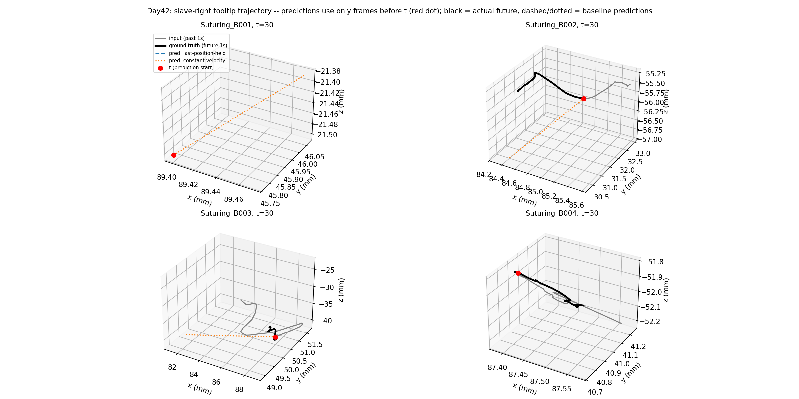

# Day42: Trajectory Forecasting — Naive Baselines

## Objective

Day41 set this arc's direction: forecast an instrument's future
kinematic trajectory from its past state, as a numeric time-series
problem (not a computer-vision one -- JIGSAWS' kinematics come
directly from the da Vinci robot's own joint encoders, independent of
the video). Before any learned model, this day establishes what
zero-training baselines achieve, following the same discipline used
throughout the CholecT50 series (a trivial baseline before crediting
any model with learning something). Any future model in this arc must
be checked against these numbers.

## Method

[`trajectory_forecasting_baseline.py`](trajectory_forecasting_baseline.py)
uses Suturing's kinematics only (Needle Passing / Knot Tying and the
other arm are natural extensions, kept out to start small). Signal:
the slave-right tooltip -- position xyz, translational velocity, and
gripper angle (columns 58-76 of the 76-dim kinematics vector, per
`readme.txt`) -- the instrument's actual position in the workspace, as
opposed to the master/console side. For every trial, a sliding window
(stride = 30 frames, no overlap) produces (past 30 frames, future 30
frames) pairs -- 1 second of context predicting 1 second ahead at
JIGSAWS' native 30fps -- yielding 4,319 windows across 39 trials.

Two closed-form baselines, both computed using only frames strictly
before the prediction start `t` (the anti-fabrication rule from
Day41):

- **Last-position-held**: predicts no movement at all -- every future
  frame equals the position/gripper-angle at `t-1`.
- **Constant-velocity**: extrapolates linearly using the robot's own
  recorded translational velocity at `t-1` (read directly from
  kinematics, not finite-differenced, so the baseline isn't
  noise-amplified by differencing a discrete signal).

Error metric: Euclidean displacement (mm) between predicted and actual
tooltip position, reported at four horizon checkpoints (+0.1s, +0.3s,
+0.5s, +1.0s) and averaged over the full 1-second horizon.

## Results

| Baseline | +0.1s | +0.3s | +0.5s | +1.0s | Mean (full 1s) |
|---|---:|---:|---:|---:|---:|
| Last-position-held | 1.21 mm | 3.40 mm | 5.30 mm | 9.46 mm | 5.28 mm |
| Constant-velocity | 0.46 mm | 2.42 mm | 5.03 mm | **12.57 mm** | 5.60 mm |

## Interpretation

**Neither baseline dominates across the whole horizon -- they cross
over.** Constant-velocity is clearly better in the short term (0.46mm
vs. 1.21mm at +0.1s, a >2.5x improvement) -- unsurprising, since real
motion has momentum and a good short-term forecast should use it. But
by +1.0s, constant-velocity is *worse* than doing nothing at all
(12.57mm vs. 9.46mm). The mechanism is straightforward: real surgical
motion decelerates, reverses, or stops (approaching a target, releasing
tissue) far more often within a full second than it continues in a
straight line -- extrapolating a straight line for a full second
compounds error every time that assumption is wrong, while "stay put"
never overshoots past the last known position by more than the
instrument's own true displacement.

**This sets a concrete, two-part bar for any future learned model.**
A model that only learns "keep moving in roughly the current
direction" would already need to beat constant-velocity's 0.46mm at
+0.1s to be worth using short-term, and a model that wants to be useful
for a full 1-second forecast needs to beat last-position-held's 9.46mm
-- which the naive constant-velocity extrapolation itself fails to do.
The crossover point (somewhere around +0.5s, where both baselines land
within 0.3mm of each other) is a reasonable place to check whether a
learned model's advantage, if any, is concentrated in the short term,
the long term, or genuinely spans both.

**The example trajectories illustrate why extrapolation degrades.**
Suturing_B002 and Suturing_B004 show real curvature and directional
change within the 1-second future window -- exactly where a straight
constant-velocity line departs furthest from the true path. Suturing_B001
and Suturing_B003 show near-stationary motion (sub-millimeter range on
most axes) during that particular window, where both baselines are
trivially close to correct and the plot mostly reflects measurement
jitter rather than meaningful motion -- a reminder that not every
1-second window is equally informative, and that whole-dataset
aggregate error (the table above) is a more trustworthy signal than
any individual example plot.

## Reflection

This is a deliberately unglamorous day -- no model, two closed-form
formulas -- but it's the day that makes every future result in this
arc interpretable. Without it, a learned model's error number would
have no reference point to be judged against, the same trap Day01/20's
absence of a trivial baseline in a differently-shaped project would
have created. The crossover finding also previews a concrete design
question for the first learned model: since neither naive strategy
works everywhere, does a model need to *detect* upcoming deceleration/
direction-change to beat both baselines across the full horizon, or is
there a simpler middle ground (e.g. damped velocity extrapolation)
worth trying before a full learned sequence model?

## Conclusion

Two zero-training baselines on Suturing's slave-right tooltip
trajectory (4,319 windows, 39 trials) show a clean crossover:
constant-velocity extrapolation wins at short horizons (0.46mm at
+0.1s vs. last-position-held's 1.21mm) but loses badly at longer ones
(12.57mm at +1.0s vs. 9.46mm), because real surgical motion changes
direction within a second far more often than it continues straight.
This gives any future learned model in this arc two concrete numbers
to beat, at two different horizons, rather than a single vague target
-- and suggests the interesting design question for Day43 is whether a
model can combine short-term momentum with longer-term awareness of
upcoming direction change, rather than committing to either extreme.
