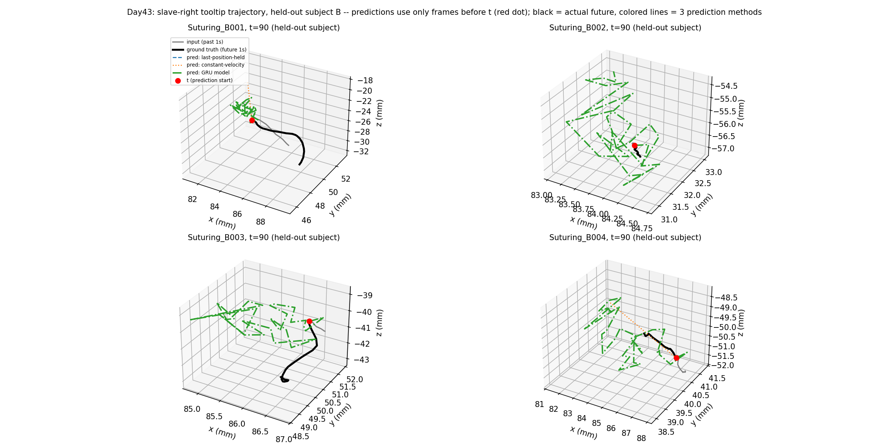

# Day43: A GRU Trajectory Model — Wins on the Metric, Fails on Physical Plausibility

## Objective

Day42 found that neither zero-training baseline dominates the full
1-second forecast horizon: constant-velocity wins short-term but loses
badly to doing nothing at all by +1.0s, because real motion changes
direction within a second more often than it continues straight. This
previewed today's question: can a learned model beat both baselines
across the horizon, by learning something about upcoming
deceleration/direction-change that neither closed-form baseline can
see?

## Method

[`gru_trajectory_model.py`](gru_trajectory_model.py) trains a single
GRU (hidden size 64) that encodes the past 1-second window (slave-right
tooltip xyz + translational velocity, 6-dim per frame -- velocity is
already present in kinematics, giving the model more than raw position
alone) into a final hidden state, then one linear layer maps that
hidden state directly to the flattened future 30-frame x 3-dim position
sequence -- a single-shot multi-step prediction, no autoregressive
rollout, kept deliberately simple for a first attempt. The model
predicts *displacement* from the last observed position rather than
absolute coordinates (an easier, near-zero-centered target).

Split: leave-one-subject-out, reproducing JIGSAWS' official UserOut
fold "1_Out" (Day41) directly by subject letter -- subject B (5 trials)
held out entirely for testing, the other 7 subjects (34 trials) used
for training. Training uses a dense sliding window (stride 5, 22,164
windows) for more training signal; evaluation uses the same
non-overlapping stride (30) as Day42, on the held-out subject only.
Input normalization statistics are fit on training data only.

**Baselines are recomputed here, restricted to the same held-out
subject's windows**, rather than compared against Day42's numbers
directly -- Day42 aggregated over all 10 subjects, so comparing the
GRU's held-out performance against a different, larger evaluation set
would not be a fair comparison.

Per Day41's anti-fabrication rule: the GRU sees only frames before the
prediction window during both training and inference; the held-out
subject's trials never appear during training.

## Results

Held-out subject B, 612 windows:

| Method | +0.1s | +0.3s | +0.5s | +1.0s | Mean (full 1s) |
|---|---:|---:|---:|---:|---:|
| GRU model | 0.82 mm | 2.27 mm | 3.84 mm | **7.98 mm** | **4.14 mm** |
| Last-position-held | 1.11 mm | 3.14 mm | 5.10 mm | 9.41 mm | 5.11 mm |
| Constant-velocity | **0.43 mm** | 2.28 mm | 4.64 mm | 11.12 mm | 5.06 mm |

**A second, independent check -- frame-to-frame step size (not
compared to ground truth, just the predicted path's own internal
smoothness) -- tells a different story:**

| | Mean step (mm) | Median step (mm) | Max step (mm) |
|---|---:|---:|---:|
| GRU predicted path | 1.258 | 0.962 | 22.863 |
| Actual ground-truth path | 0.388 | 0.176 | 9.623 |

## Interpretation

**On the metric Day42 established, the GRU wins.** It beats both
baselines on mean error over the full horizon (4.14mm vs. 5.11mm and
5.06mm) and beats both individually at every checkpoint from +0.3s
onward -- confirming a learned model *can* do better than either naive
strategy once the horizon is long enough that upcoming direction change
matters. Constant-velocity still wins narrowly at +0.1s (0.43mm vs.
0.82mm), where the true recorded velocity is close to optimal and the
GRU's smoothing costs it a small amount of short-term precision.

**But the frame-to-frame step size reveals the predicted path itself is
not a physically plausible trajectory.** The GRU's predicted points
move over 3x farther between consecutive frames than real tooltip
motion ever does (mean 1.258mm vs. 0.388mm), and this is visible
directly in the example plots: the ground-truth path (black) is a
smooth curve, while the GRU's predicted path (green) is a visibly
jagged scribble around the general vicinity of the true trajectory.
The mechanism is exactly what the architecture invites: predicting all
30 future frames from one linear layer, in one shot, with no
constraint that frame *k*'s predicted position have any particular
relationship to frame *k+1*'s, gives the model no reason to produce a
smooth path -- only a reason to get each individual frame's position
close to the truth, which a jittery-but-centered prediction can do about
as well as a smooth one, on average.

**This means the headline win (beats both baselines on mean error) is
real but incomplete, and reporting only that number would be
misleading about what the model actually learned.** A displacement
metric averaged per-frame cannot see that the predicted *path* is
implausible, because it never checks the relationship between
consecutive predicted frames -- only each frame's isolated distance
from ground truth. This is the same category of lesson as Day30's "a
falling loss curve isn't proof of useful learning" and "representational
capability must be checked, not assumed" -- here, "beats the baseline
on the target metric" isn't proof the model learned trajectory
dynamics, and needed a second, independent check (smoothness) to catch
what the primary metric couldn't.

## Reflection

This is a genuinely split result, and reporting it as a clean win would
have been the easy, less honest version of this day. The architecture
choice (single-shot linear decoding of all 30 future frames from one
hidden vector) was picked for simplicity, and simplicity turned out to
have a real cost that the evaluation metric almost hid. The fix is not
obviously "make the model bigger" -- it's a structural change:
something that predicts one step at a time and feeds its own prediction
back in (autoregressive decoding, closer to how Day17's from-scratch
RNN and Day25's GRU actually consumed sequences token-by-token), or an
explicit smoothness penalty added to the loss, would both directly
target the mechanism identified here rather than the symptom.

## Conclusion

A single-GRU trajectory model beats both of Day42's naive baselines on
mean displacement error over a 1-second horizon (4.14mm vs. 5.11mm and
5.06mm), confirming a learned model can capture something about
upcoming motion that constant-velocity and last-position-held cannot.
But an independent smoothness check shows the model's predicted paths
move more than 3x farther between consecutive frames than real
tooltip motion ever does -- a physically implausible, jittery
trajectory that the per-frame displacement metric cannot detect. Day44's
natural next step is a structural fix for this specific failure mode
(autoregressive step-by-step decoding, or a smoothness-penalized loss)
rather than treating today's metric win as the finish line.
