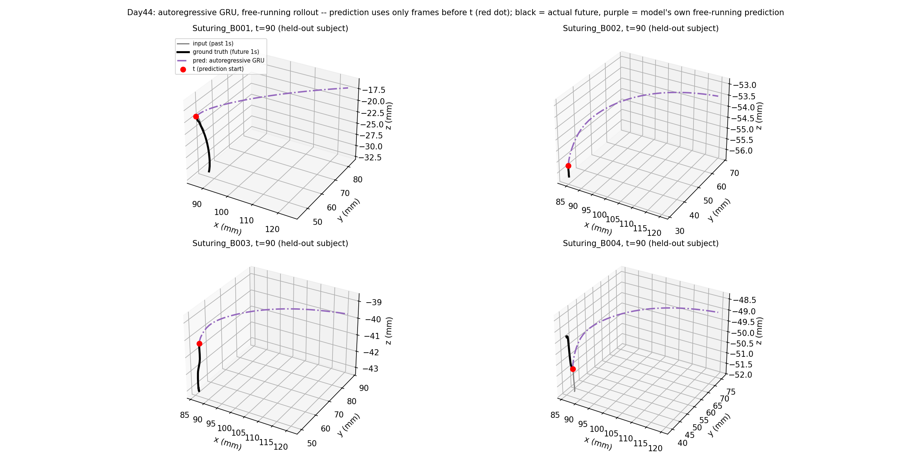

# Day44: Autoregressive Decoding — The Named Risk Materializes, Badly

## Objective

Day43's single-shot GRU beat both of Day42's baselines on mean
displacement error, but its predicted paths were over 3x jitterier
than real tooltip motion -- traced to the architecture's lack of any
constraint linking consecutive predicted frames. Today tests the
structural fix aimed directly at that mechanism: an autoregressive
decoder, predicting one step's displacement at a time, each step
conditioned on the previous one through the recurrence. The risk was
named explicitly before running anything: autoregressive rollout can
accumulate its own one-step errors over 30 steps (exposure bias),
potentially trading Day43's jaggedness for a drift problem instead.

## Method

[`autoregressive_trajectory_model.py`](autoregressive_trajectory_model.py)
keeps Day43's encoder (a GRU over the past 1-second window, same
6-dim input) but replaces the single linear decoder with a `GRUCell`
that runs 30 times, once per future frame: at each step it takes the
previous step's displacement as input, updates its hidden state, and
predicts the next displacement. **Training uses teacher forcing** (the
decoder is fed the *true* previous delta at each step, standard
practice for stabilizing recurrent training). **Evaluation uses free-
running rollout** (the decoder is fed its *own* previous prediction,
since that's the only information available at real prediction time,
and it's what actually produces the trajectory being evaluated).

Same held-out subject (B, matching Day43's UserOut fold), same
baselines recomputed on identical windows, same two metrics as Day43
(displacement error at four horizon checkpoints, and frame-to-frame
step size as an independent smoothness check).

## Results

Held-out subject B, 612 windows, free-running rollout:

| Method | +0.1s | +0.3s | +0.5s | +1.0s | Mean (full 1s) |
|---|---:|---:|---:|---:|---:|
| Autoregressive GRU | 1.80 mm | 8.20 mm | 17.75 mm | **51.73 mm** | **21.28 mm** |
| Last-position-held | 1.11 mm | 3.14 mm | 5.10 mm | 9.41 mm | 5.11 mm |
| Constant-velocity | 0.43 mm | 2.28 mm | 4.64 mm | 11.12 mm | 5.06 mm |

Training loss (teacher-forced MSE on per-step delta) dropped to
0.00000010 by epoch 10 -- essentially as close to zero as this metric
can meaningfully go.

## Interpretation

**The named risk didn't just materialize -- it dominates everything
else.** The autoregressive model is 4-5x worse than both baselines on
mean error, and over 5x worse specifically at the +1.0s checkpoint
(51.73mm vs. 9.41-11.12mm). This is a clean, severe case of exposure
bias: near-perfect training loss under teacher forcing measures how
well the model predicts the next delta *given the true previous
delta* -- a much easier problem than free-running rollout, where every
small error in the model's own output becomes part of its next input,
and 30 compounding steps of that is enough to destroy the prediction
entirely.

**The example plots reveal something more specific than generic
drift: the four held-out trials produce nearly the same curved
trajectory shape, regardless of their actual input windows.** This
isn't just "the error grows" -- it looks like the free-running
decoder's dynamics are dominated by the `GRUCell`'s own attractor
behavior rather than by the specific context the encoder provided.
Once the decoder's input (its own predicted delta) drifts even
slightly off the distribution of true deltas it was trained on, the
recurrence appears to settle into a generic, input-independent curve
rather than tracking anything about the actual trajectory it started
from. The encoder's hidden state, which only enters the decoder once
at step 0, isn't enough to keep steering the rollout once the delta
input itself has gone out-of-distribution.

**This means the fix, in this naive form, is worse than the problem it
was meant to solve.** Day43's jagged-but-accurate model is more useful
than today's smooth-but-wildly-wrong one -- smoothness alone was never
the goal, it was a proxy for "is this a physically real trajectory,"
and a trajectory that ignores its own input is not more physically
real just because it happens to be smooth. Beating Day42's baselines
(the actual bar set two days ago) still hasn't been done by anything
in this arc except Day43's flawed model.

## Reflection

Naming a risk in advance and then having it dominate the result this
completely is a useful kind of validation of the diagnostic process,
even though the fix itself failed: the reasoning that predicted this
outcome (compounding one-step errors over a long rollout) was correct,
and worth trusting again next time a similar structural choice comes
up. The standard mitigation for exactly this problem -- scheduled
sampling, where training gradually mixes in the model's own predictions
instead of only ever using teacher forcing, so the model learns to
recover from its own small errors rather than only ever seeing perfect
inputs -- was not attempted here and is the natural next thing to try,
rather than abandoning autoregressive decoding on this one naive
attempt. A second, lower-effort alternative also remains untried: go
back to Day43's single-shot architecture and add a smoothness penalty
directly to the loss, sidestepping the exposure-bias risk entirely by
never introducing autoregression at all.

## Conclusion

An autoregressive decoder, meant to fix Day43's jagged-but-accurate
trajectories by directly targeting their cause (no constraint linking
consecutive frames), instead produced smooth-but-catastrophically-wrong
trajectories: 21.28mm mean error and 51.73mm at +1.0s, 4-5x worse than
Day42's naive baselines, driven by severe exposure bias between
teacher-forced training and free-running evaluation. The example plots
show something more specific than plain drift -- the model's
free-running rollout appears to converge toward a generic,
largely input-independent curve rather than tracking the trial it
actually started from. Day43's flawed single-shot model remains this
arc's only result that beats both baselines; Day45's natural next
attempts are scheduled sampling (to fix exposure bias without
abandoning autoregression) or a smoothness-penalized loss on Day43's
original architecture (to fix jaggedness without introducing
autoregression's risk at all).
