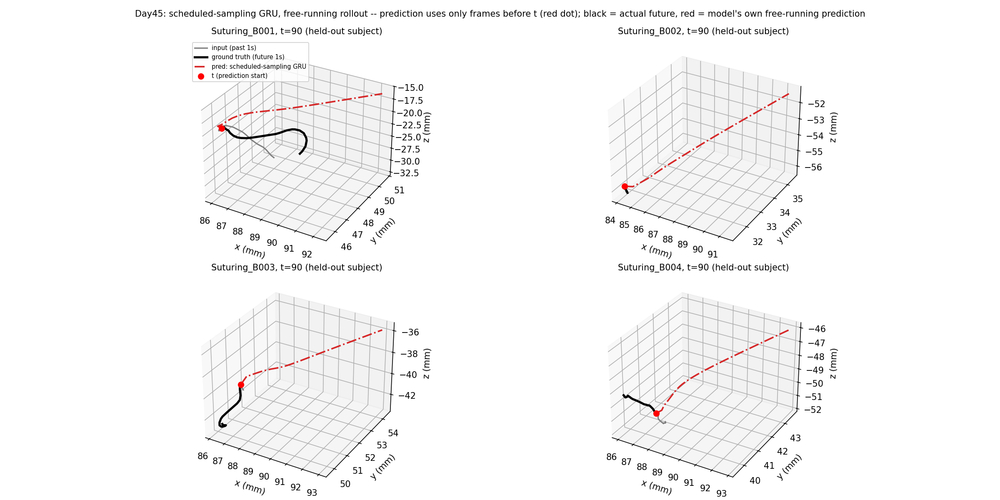

# Day45: Scheduled Sampling — Smoothness Fixed, Accuracy Still Not There

## Objective

Day44's autoregressive decoder failed badly (4-5x worse than Day42's
baselines) because it was trained with pure teacher forcing but
evaluated free-running -- a severe train/eval mismatch (exposure bias)
that caused the model's rollout to collapse toward a generic,
input-independent curve. Day44's Reflection named the standard fix:
scheduled sampling (Bengio et al., 2015) -- gradually training the
model on its own predictions instead of only ever showing it perfect
inputs, so it learns to recover from its own small errors rather than
never encountering them until evaluation.

## Method

[`scheduled_sampling_trajectory_model.py`](scheduled_sampling_trajectory_model.py)
keeps Day44's exact architecture (GRU encoder, `GRUCell` decoder,
per-step displacement prediction) and evaluation protocol (free-running
rollout, same held-out subject B, same baselines recomputed on
identical windows). The only change: at each decode step during
training, the model is fed its *own* previous prediction instead of
the true delta with probability `p`, where `p` ramps **linearly from 0
(epoch 1, pure teacher forcing) to 1.0 (final epoch, pure free-running)**
-- so by the last epoch, training conditions exactly match evaluation
conditions, and the model has no choice but to learn to tolerate its
own errors.

## Results

Held-out subject B, 612 windows, free-running rollout:

| Method | +0.1s | +0.3s | +0.5s | +1.0s | Mean (full 1s) | Step size (mean) |
|---|---:|---:|---:|---:|---:|---:|
| Scheduled-sampling GRU | 1.33 mm | 3.55 mm | 6.15 mm | 12.96 mm | 6.51 mm | **0.353 mm** |
| Day44 pure autoregressive (reference) | 1.80 mm | 8.20 mm | 17.75 mm | 51.73 mm | 21.28 mm | 1.755 mm |
| Day43 single-shot GRU (reference) | 0.82 mm | 2.27 mm | 3.84 mm | 7.98 mm | 4.14 mm | 1.258 mm |
| Last-position-held | 1.11 mm | 3.14 mm | 5.10 mm | 9.41 mm | 5.11 mm | 0.000 mm |
| Constant-velocity | 0.43 mm | 2.28 mm | 4.64 mm | 11.12 mm | 5.06 mm | 0.395 mm |
| *Ground truth path (reference, not a prediction)* | -- | -- | -- | -- | -- | *0.388 mm* |

## Interpretation

**Scheduled sampling fixed exactly the problem it targeted, dramatically.**
Mean error dropped from Day44's 21.28mm to 6.51mm -- a 3.3x improvement
-- and the +1.0s checkpoint improved from a catastrophic 51.73mm to
12.96mm. The smoothness metric tells an even cleaner story: the
predicted path's frame-to-frame step size (0.353mm) is now *closer to
the real ground-truth path's own step size (0.388mm) than either naive
baseline gets* (constant-velocity: 0.395mm). This is the best
smoothness result anywhere in this arc -- the model is no longer
producing anything jittery or collapsed, and the example plots confirm
it: each of the four panels shows a distinct, smooth curve, not the
identical generic shape Day44 produced regardless of input.

**But the model still doesn't beat either baseline on displacement
error, and is worse than Day43's flawed jagged model.** 6.51mm mean
error sits above both last-position-held (5.11mm) and constant-velocity
(5.06mm), and well above Day43's 4.14mm. The example plots suggest why:
the model's free-running predictions look close to smooth, near-linear
extrapolations of the initial direction, rather than paths that track
the sharper curvature ground truth actually shows (visible in
Suturing_B001 and Suturing_B003, where the black ground-truth path
curves away while the red prediction continues on a straighter course).
Scheduled sampling taught the model to produce *stable, self-consistent*
rollouts -- but stability and accuracy are different things, and this
model bought stability partly at accuracy's expense relative to
Day43's noisier-but-sharper single-shot predictions.

**This arc now has three learned models, no overlap between the two
things being optimized for.** Day43: accurate (beats baselines) but
jagged. Day44: neither accurate nor smooth (catastrophic). Day45:
smooth (matches ground truth almost exactly) but not accurate enough to
beat baselines. No single model in this arc has achieved both
properties simultaneously -- accuracy and physical plausibility have
so far behaved as a trade-off rather than a hierarchy where fixing one
fixes the other.

**A caveat the owner raised, worth stating plainly before drawing any
further conclusions from the +1.0s numbers**: a 1-second horizon may
be close to the actual ceiling of what's predictable from kinematic
trajectory alone, not a target every model should eventually crack.
Suturing motion is driven by the surgeon's ongoing judgment -- when to
stop pulling thread, when to reposition, when to insert the needle --
and that intent isn't encoded in 30 frames of past position and
velocity. Every method tried across Day42-45 (both naive baselines and
all three learned models) shows the same qualitative pattern: error
grows roughly 10x from +0.1s to +1.0s, regardless of approach. That
consistency, across four structurally different methods, is itself
evidence this is closer to an information limit than a fixable
modeling gap -- the same kind of distinction Day22 drew for CholecT50's
verb recognition (single-frame information limit vs. architecture
gap), applied here to trajectory forecasting instead of frame
classification. This doesn't make the +1.0s numbers meaningless, but
it reframes what "improving" them further would mean: closing the
remaining gap between today's ~6.5mm and whatever this ceiling actually
is, not chasing arbitrarily better numbers as if a smarter model could
approach zero error.

## Reflection

This is real progress on the specific failure Day44 diagnosed, and
scheduled sampling clearly works as advertised for exposure bias -- but
it's a reminder that fixing the named risk doesn't automatically
recover Day43's advantage on the metric that actually matters most
(beating the baselines Day42 established). The two untried ideas from
Day44's Reflection have now diverged in outcome: scheduled sampling
(tried today) fixed smoothness but not accuracy; the other option
(going back to Day43's single-shot architecture and adding a
smoothness penalty directly to its loss, never introducing
autoregression at all) remains untried and is now the more promising
candidate specifically because it starts from the model that already
wins on accuracy, rather than starting from an architecture that has to
be coaxed into stability first.

## Conclusion

Scheduled sampling resolves Day44's exposure-bias failure decisively:
mean error drops 3.3x (21.28mm to 6.51mm) and the model's predicted
path smoothness (0.353mm mean step) now essentially matches real
tooltip motion (0.388mm) -- the best smoothness result in this arc so
far. But the model still falls short of both of Day42's naive baselines
on displacement error, and of Day43's less-stable single-shot model.
Three learned models in, this arc has not yet produced one that is
both accurate and physically plausible at once -- Day46's natural next
step is the alternative named but not yet tried: apply a smoothness
penalty directly to Day43's single-shot architecture, testing whether
accuracy and plausibility can be won together by starting from the
model that already has the accuracy edge. That said, the +1.0s numbers
themselves should be read with the owner's caveat in mind: the same
~10x error growth from +0.1s to +1.0s shows up in every method tried
here, naive or learned, which looks less like a gap a cleverer
architecture will simply close and more like a real ceiling on how far
ahead trajectory alone can be predicted once the surgeon's own
in-the-moment judgment -- not visible in past kinematics -- starts to
matter.
