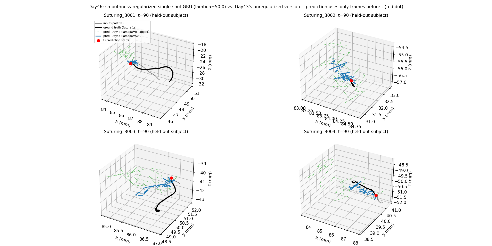

# Day46: Smoothness-Regularized Single-Shot Model — Real Progress, Still Not Solved

## Objective

This arc has produced three learned models with no overlap between
what they got right: Day43's single-shot decoder is accurate (beats
Day42's baselines) but jagged; Day44's autoregressive decoder is
neither accurate nor smooth (catastrophic exposure bias); Day45's
scheduled-sampling version fixed the smoothness almost perfectly but
still can't beat the baselines on accuracy. Day44's Reflection named
the untried alternative: go back to Day43's architecture (which
already has the accuracy edge) and add a smoothness penalty directly
to the loss, introducing no autoregression and therefore none of
Day44-45's exposure-bias risk at all.

## Method

[`smoothness_regularized_model.py`](smoothness_regularized_model.py)
uses Day43's exact architecture (GRU encoder, one linear layer
decoding the flattened future 30x3 displacement) with one addition: a
discrete jerk penalty (squared second finite difference of predicted
position, anchored to the real last-observed position so the join
between known history and prediction is smooth too) added to the
position MSE loss, weighted by `lambda`. Following this project's
standing practice of checking a hyperparameter directly rather than
picking one value (Day26's `pos_weight`, Day33's batch size), `lambda`
is swept over {0, 1, 10, 50} -- `lambda=0` exactly reproduces Day43.
Same held-out subject B, same baselines, same evaluation protocol.

## Results

| lambda | Mean error (mm) | +1.0s (mm) | Step size (mm) |
|---|---:|---:|---:|
| 0 (= Day43) | 4.14 | 7.98 | 1.258 |
| 1 | **4.13** | 8.38 | 0.796 |
| 10 | 4.14 | 8.39 | 0.752 |
| 50 | 4.19 | 8.37 | **0.512** |
| Last-position-held (baseline) | 5.11 | 9.41 | 0.000 |
| Constant-velocity (baseline) | 5.06 | 11.12 | 0.395 |
| *Ground truth path (reference)* | -- | -- | *0.388* |

**A third metric, checked after the step-size result looked
encouraging**: path efficiency (net displacement over the 1-second
window, divided by total path length traveled) -- 1.0 for a straight
line, closer to 0 for a path that wanders back and forth without
making progress.

| | Path efficiency |
|---|---:|
| lambda=0 (Day43) | 0.161 |
| lambda=50 (Day46) | 0.285 |
| Ground truth path | **0.705** |
| Constant-velocity (reference, trivially 1.0) | 1.000 |

## Interpretation

**The jerk penalty delivers real, close-to-free improvement on the
metric it targets.** Step size drops from 1.258mm (Day43) to 0.512mm
at `lambda=50` -- a 59% reduction, closing most of the gap to ground
truth's 0.388mm -- while mean displacement error barely moves (4.14mm
to 4.19mm, within noise) and stays clearly ahead of both baselines
(5.06-5.11mm) at every lambda tested. Unlike Day45's scheduled
sampling, which bought smoothness at real accuracy cost, this
regularizer gets both at once, and does so with a training procedure
no more complex than Day43's -- no autoregression, no exposure-bias
risk, no free-running/teacher-forcing mismatch to manage.

**But path efficiency shows the smoothness win is narrower than the
step-size number suggested.** Even at `lambda=50`, the model's path
efficiency (0.285) is still less than half of real motion's (0.705) --
the jerk penalty reduced how *large* each zigzag is, but did not teach
the model to commit to a net direction. The example plots confirm
this directly: `lambda=50`'s predictions (blue) show visibly smaller,
tighter oscillations than Day43's (green), but still oscillate, rather
than tracing anything close to the black ground-truth path's largely
one-directional curve. A path can have small, locally-smooth steps
(what step-size measures) while still going nowhere in particular
(what path efficiency measures) -- these are different properties, and
today's regularizer only targeted the first one.

**This is the same category of lesson Day43 already taught, one level
deeper.** Day43 needed a second metric (step size) to see that a model
winning on displacement error was still physically implausible. Today
needed a *third* metric (path efficiency) to see that a model now
winning on both displacement error and step size is still not
producing genuinely purposeful motion. Each metric catches a
specific, narrow way a prediction can look right while being wrong;
none of them, individually, is sufficient evidence of a good
trajectory model, and this arc has now needed three before getting a
reasonably complete picture.

## Reflection

This day is a clear net improvement -- best combined accuracy-and-
smoothness result in the arc, without any of Day44-45's structural
risk -- but reporting only the step-size number and stopping there
would have repeated exactly the mistake Day43 was written specifically
to avoid. Looking at the `lambda=50` example plots directly, the owner
raised a more fundamental objection than "try a different smoothing
technique": a moving-average-style smoother could shrink the step-size
number further too, without teaching the model anything -- smoothness
was only ever meant as a proxy for "is this trajectory physically
real," and the path-efficiency result shows it's a proxy that can be
gamed without actually getting closer to that goal.

This led to a broader discussion of whether *unconditional* trajectory
forecasting is the right target at all. The motion being predicted is
generated by a human surgeon's real-time, moment-to-moment judgment --
not law-like physical dynamics -- so a model with no information about
what the surgeon is about to decide is, in an important sense, trying
to predict something that isn't determined by anything in its input.
Chasing smoother-looking output against that ceiling risks optimizing a
proxy metric rather than making genuine progress. Two ways forward
were discussed: (1) condition the model on the current gesture label
(already present in JIGSAWS' transcriptions) -- reframing the task
from "guess the surgeon's undetermined next move" to "model the
characteristic dynamics of a *known* gesture," a well-posed problem
much closer to how a real world model operates conditioned on an
action -- or (2) drop trajectory regression entirely in favor of
anomaly/deviation detection (is the current motion typical for its
context or not), connecting directly to Day40's Clinical Implications
argument that hazard-awareness, not fine-grained prediction, is where
real value would be. The owner chose to pursue (1) first, with (2) as
a later direction once (1) has been explored -- both explicitly reframe
the problem to be well-posed instead of trying to out-smooth an
unconditioned, arguably under-determined target.

## Conclusion

Adding a jerk penalty to Day43's single-shot architecture achieves
this arc's best accuracy-smoothness trade-off yet: step size drops 59%
(1.258mm to 0.512mm, close to ground truth's 0.388mm) with essentially
no accuracy cost (4.14mm to 4.19mm, still clearly ahead of both
baselines), and without introducing any of the autoregressive
approach's exposure-bias risk. But a third diagnostic -- path
efficiency -- shows this doesn't yet amount to genuinely purposeful
motion: even the best-regularized model's predicted paths are still
less than half as directionally efficient as real tooltip movement
(0.285 vs. 0.705), and the owner's read of the example plots is that
this reflects a deeper problem with the task itself, not just this
model: forecasting a human-operated instrument's future path from
motion history alone is trying to predict something genuinely
under-determined by that input, since the actual next move depends on
the surgeon's moment-to-moment judgment. This closes the unconditional
trajectory-forecasting line of this arc (Day42-46). Day47 pivots to
gesture-conditioned motion modeling -- using JIGSAWS' existing gesture
labels to reframe the problem as "model the dynamics of a known
gesture" rather than "predict an undetermined future choice" -- with
anomaly/deviation detection (tied to Day40's hazard-awareness framing)
as a further direction after that.
