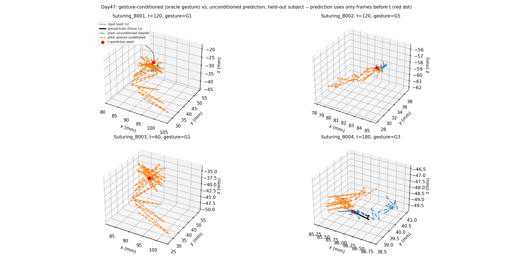

# Day47: Gesture-Conditioned Motion Modeling — A Weak, Mixed Result

## Objective

Day46 closed the unconditional trajectory-forecasting line with a
concern the owner raised directly: forecasting a human-operated
instrument's path from motion history alone may be trying to predict
something genuinely under-determined by that input, since the actual
next move depends on the surgeon's real-time judgment, not visible in
past kinematics. The agreed pivot: model the dynamics of a *known*
gesture instead of guessing an undetermined future choice. Today tests
this directly -- does telling the model which gesture (of JIGSAWS' ~10
categories) is being executed improve prediction, especially path
efficiency, the metric Day46 showed was still far from real motion
(0.285 vs. 0.705)?

## Method

[`gesture_conditioned_model.py`](gesture_conditioned_model.py) uses
Day46's best recipe (GRU encoder, single-shot linear decoder, jerk
penalty at `lambda=50`) with one addition: the gesture one-hot (10
classes, from Day41's transcriptions) is concatenated to the GRU's
final hidden state before decoding. Following Day37's precedent in the
CholecT50 series (oracle instrument conditioning before a realistic
version), this uses the **true** gesture label for the prediction
window -- an idealized test of "does knowing the intent help," not yet
a deployable system (a realistic version would need a separate gesture
predictor, the way Day38 followed Day37 there).

Windows are restricted to those where a single gesture covers the
entire 60-frame span (30 past + 30 future) -- if the gesture changes
mid-window, the "known gesture" premise doesn't cleanly apply. This
drops most windows (7,967 of ~22,000 train windows, 195 of 612 test
windows) since JIGSAWS' gesture segments (mean ~150-160 frames, Day41)
often don't fully contain a 60-frame span without a boundary crossing.
Both an unconditioned model (Day46's recipe, retrained on this same
filtered window set for a fair comparison) and the gesture-conditioned
model are evaluated identically on the held-out subject's filtered
windows.

## Results

Held-out subject B, 417 gesture-filtered test windows:

| | Mean error (mm) | +1.0s (mm) | Step size (mm) | Path efficiency |
|---|---:|---:|---:|---:|
| Unconditioned (Day46 recipe) | **3.91** | **7.37** | **0.770** | 0.151 |
| Gesture-conditioned (oracle) | 4.27 | 7.95 | 1.013 | **0.211** |
| *Ground truth (reference)* | -- | -- | *0.342* | *0.691* |

## Interpretation

**Gesture conditioning did not deliver the hoped-for improvement, and
made two of the three metrics worse.** Displacement error rose from
3.91mm to 4.27mm, and step size rose from 0.770mm to 1.013mm -- the
conditioned model is *less* accurate and *more* jagged than the
unconditioned one, both trained and evaluated identically otherwise.
The example plots confirm this isn't a metric artifact: the
gesture-conditioned predictions (orange) visibly swing through larger,
wilder excursions than the unconditioned ones (blue) in three of the
four panels.

**Path efficiency did improve (0.151 to 0.211), but only modestly, and
this doesn't close much of the gap to real motion (0.691).** The
improvement recovers roughly 11% of the remaining gap
((0.211-0.151)/(0.691-0.151)) -- a real but small effect, not the
qualitative shift the hypothesis motivating this day predicted.
Knowing the gesture category helped the model make *somewhat* more
directed progress, but nowhere near enough to explain why real motion
is so much more purposeful than any model produced here.

**A plausible explanation: gesture category is a coarse label for a
long, internally varied span of motion.** A single gesture like "G3,
pushing needle through tissue" (Day41: mean segment length ~150-160
frames, several times longer than this day's 60-frame window) likely
contains very different motion at its start, middle, and end --
approaching the tissue, actively pushing, withdrawing. Knowing only
*which* gesture is active, without knowing *where within it* the
current window sits, may not narrow down the space of plausible future
motion by much -- consistent with the small, not dramatic, path-
efficiency gain. It's also possible the conditioning signal, injected
only once (concatenated to the final hidden state before a single
linear decode), is architecturally too weak a channel for the model to
use effectively, separate from whether gesture identity itself carries
enough information.

## Reflection

This is a useful negative result precisely because the reframing
(condition on known intent rather than guess undetermined intent) was
well-motivated, and still didn't deliver the improvement expected --
which says something concrete rather than just "this attempt failed."
It suggests the missing information isn't well captured by a coarse
gesture category at all, and narrows what's worth trying next: either
a finer-grained conditioning signal (e.g. normalized progress within
the gesture segment, or the specific target of the motion within a
gesture), or accepting that gesture-level conditioning alone was never
going to be a strong enough signal and shifting toward the other
direction discussed after Day46 -- anomaly/deviation detection, which
doesn't require predicting *where* the instrument goes next at all,
only whether current motion looks typical for its context.

## A Follow-Up Check: Is Needle-Driving Specifically More Predictable?

The owner proposed a sharper, mechanically-grounded version of the
gesture-conditioning idea: while most of suturing is the surgeon's
free choice (how to approach the entry point, where to regrasp, how to
route the needle to the next stitch), the specific moment the needle is
embedded in tissue and rotated through it (G3, "pushing needle through
tissue") is constrained by the needle's own fixed curvature -- closer
to a mechanically determined arc than a free decision. If true, G3
specifically should be far more predictable than other gestures.

Checked directly (no retraining -- Day47's own test windows and
unconditioned model, broken down by gesture):

| Gesture | Description | n | Mean error (mm) | Relative error (err / path length) |
|---|---|---:|---:|---:|
| G1 | Reaching for needle | 4 | 2.08 | 1.60 |
| G2 | Positioning needle | 38 | 4.14 | 1.10 |
| **G3** | **Pushing needle through tissue** | 179 | 2.59 | **0.77** |
| G4 | Transferring needle L->R | 36 | 2.51 | 0.42 |
| G6 | Pulling suture | 89 | 7.57 | 0.33 |
| G8 | Orienting needle | 46 | 2.66 | 0.67 |

Ground-truth path efficiency, broken down the same way, tells a similar
story: G3's path efficiency (mean 0.671) is unremarkable among the
other gestures (range 0.558-0.810 across G1-G11), not a standout.

**G3 is not the standout the hypothesis predicted -- if anything, G4
and G6 show lower relative error.** Two likely reasons this doesn't
confirm the mechanical-constraint intuition, neither of which
contradicts the underlying reasoning about the needle itself: (1) this
project tracks the *instrument tooltip* (the needle driver the surgeon
holds), not the needle tip -- the needle's arc may be constrained, but
the driver can reach that same arc through different wrist motions, so
the tracked signal doesn't inherit the needle's own constraint
directly; (2) a G3-labeled window spans the whole gesture (Day41: mean
~150-160 frames), which likely mixes the constrained in-tissue arc with
less-constrained approach and exit motion, diluting any signal a purer,
sub-gesture-phase window might show. This is a genuine null result for
the hypothesis as tested, not evidence the mechanical intuition itself
is wrong -- it points at a measurement gap (driver position vs. needle
position; whole-gesture windows vs. isolated in-tissue-arc windows)
rather than settling the question.

## Conclusion

Conditioning trajectory prediction on the true gesture label (oracle,
following Day37's precedent) produced a small, real gain in path
efficiency (0.151 to 0.211) but made accuracy and smoothness worse
(3.91mm to 4.27mm; 0.770mm to 1.013mm step size), and remains far short
of real motion's path efficiency (0.691). The likely explanation is
that a coarse ~10-category gesture label doesn't sufficiently
disambiguate the wide range of motion a single gesture spans over a
150+ frame segment. This tempers the pivot from Day46: knowing the
gesture category helps only marginally, which weakens (without fully
ruling out) the case for continuing down the trajectory-conditioning
line versus moving toward anomaly/deviation detection, the other
direction discussed after Day46.
