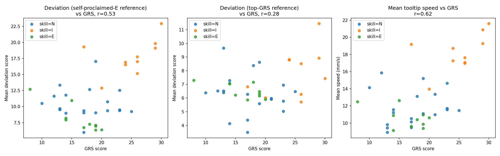

# Day49: Gesture-Conditioned Deviation Detection — Confounded by Speed, Not Skill

## Objective

Day48 closed the trajectory-forecasting arc: six methods converged on
the same ceiling, evidence that a human-teleoperated instrument's
exact future path is close to an information limit, not a solvable
modeling gap. The owner chose to pivot toward a differently-shaped,
well-posed problem: instead of guessing an undetermined future
coordinate, ask a descriptive question -- is the *current* motion
typical for its context (gesture), or does it deviate? Today builds
the first version of this and checks it against an independent,
already-existing signal (skill labels) that were never used to fit it.

## Method

[`gesture_conditioned_anomaly_detection.py`](gesture_conditioned_anomaly_detection.py)
defines "normal" motion per gesture (Day41's ~10-category Suturing
vocabulary) using a reference group of trials, then scores every
trial's frames by how many squared standard deviations (per motion
feature) they land from that gesture's reference mean -- a simple,
interpretable deviation score, no neural network. Features are motion-
*state* variables only (translational velocity, rotational velocity,
gripper angle -- 7 dims), not absolute position, since position depends
on where a trial happens to be set up in the workspace and isn't
comparable across trials. Reference-group trials are scored with
leave-one-trial-out statistics (never against a distribution containing
themselves); everyone else is scored against the full reference fit.
This uses zero skill labels to build the score -- skill (self-proclaimed
N/I/E) and GRS are used only afterward, as an external check.

Two reference groups were tried, same size (n=10) for a clean
comparison:
- **Self-proclaimed expert** (the original plan): trials where the
  subject rated themselves "E" (>100 hours of experience).
- **Top-GRS** (added after the first result below): the 10 trials with
  the highest independently-rated GRS score, regardless of
  self-proclaimed skill.

## Results

**Self-proclaimed skill does not track GRS well in this dataset.**
Mean GRS by self-proclaimed group: N=17.5, **I=25.1 (highest)**,
**E=16.3 (lowest)** -- the self-proclaimed "experts" have, on average,
the *worst* independently-rated performance of the three groups.

| Reference group | Mean deviation: N | I | E | Correlation (deviation vs. GRS) |
|---|---:|---:|---:|---:|
| Self-proclaimed expert | 10.50 | **17.75** | 8.06 | r = **+0.53** |
| Top-GRS | 6.30 | **7.88** | 6.55 | r = **+0.28** |

Both references show the same qualitative pattern: deviation
*increases* with GRS, not decreases, and 'I' (the highest-GRS group)
has the highest deviation under both references.

**A direct check of the suspected confound**: mean tooltip speed vs.
GRS, r = **+0.62** -- higher-GRS trials move measurably faster (mean
speed by skill: N=11.8mm/s, I=18.3mm/s, E=10.6mm/s -- the same
non-monotonic-by-self-proclaimed-skill, GRS-tracking pattern as the
deviation scores themselves).

## Interpretation

**Two nested diagnoses were needed before this result made sense, and
both are genuine findings in their own right.** First: self-proclaimed
skill (hours of experience) is a poor proxy for measured technique
(GRS) in this specific set of Suturing trials -- confirming a question
raised back in Day41 ("is the self-report and the rater-assessed score
even the same thing?") with a concrete, surprising answer: no, not
here, not even directionally (self-proclaimed "experts" score lowest).
Switching the reference group from self-proclaimed-E to top-GRS should
fix a deviation score confounded by a bad reference -- and it did
shrink the effect (r dropped from 0.53 to 0.28), but the qualitative
problem remained.

**Second, deeper diagnosis: the deviation score is dominated by
tooltip speed, and speed itself correlates positively with GRS in this
dataset.** This is the opposite of the intuitive assumption motivating
the whole day (deviation from "normal" ≈ worse technique). Here, more
skilled work is *faster*, not closer to a population average -- so a
deviation score built from raw velocity features mechanically produces
a positive, not negative, correlation with GRS, regardless of which
reference group is used to define "normal." The method isn't
measuring skill at all; it's measuring how much a trial's speed
differs from whatever reference set was chosen, and in this dataset
that mostly tracks GRS in the wrong direction because faster
execution *is* the better-performing group's signature.

**This doesn't mean deviation-from-typical is a dead end, but it
means raw velocity is the wrong feature for it.** Surgical-skill
literature generally associates skill with movement *economy* --
smoothness, fewer direction reversals, less wasted motion -- rather
than with speed per se, and this project already has directly relevant
machinery: Day46's jerk penalty and step-size/path-efficiency
diagnostics were built exactly to separate "moves a lot" from "moves
purposefully." A deviation score built on jerk or path-efficiency-style
features, rather than raw velocity, would test the more literature-
consistent hypothesis and might not carry the same speed confound.

## Reflection

This is a case where checking against ground truth twice -- first
against skill/GRS, then against the raw feature (speed) driving the
unexpected result -- turned an initially confusing, seemingly
inconclusive finding into a clear, specific diagnosis, rather than a
data point in the "何とも言えない" pile the owner named after Day47.
The lesson isn't "anomaly detection doesn't work here"; it's "this
specific feature choice measures something (speed) that happens to
correlate with skill in the wrong direction for this dataset," which
is a precise, actionable finding rather than an ambiguous one. It's
also a second, independent confirmation (after Day47's self-proclaimed-
vs-GRS mismatch surfaced through gesture conditioning) that this
dataset's self-proclaimed skill labels should not be trusted as a
stand-in for GRS in any future analysis without checking first.

## Conclusion

A gesture-conditioned deviation score built from raw motion-state
features doesn't validate against skill as hoped: it correlates
*positively* with GRS (self-proclaimed-expert reference: r=+0.53;
top-GRS reference: r=+0.28) rather than negatively, and the reason is
now precisely diagnosed rather than left as noise -- tooltip speed
itself correlates positively with GRS in this dataset (r=+0.62), and
the deviation score is dominated by speed. Self-proclaimed skill labels
were also confirmed (a second time, after Day47) to be a poor proxy
for GRS here. The path forward isn't to abandon deviation detection,
but to rebuild it on movement-economy features (jerk, path efficiency
-- both already implemented in Day46) instead of raw velocity, testing
the more literature-consistent hypothesis that skill shows up in
*how* motion is executed, not how fast.
