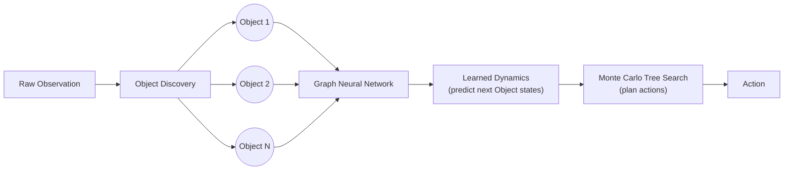
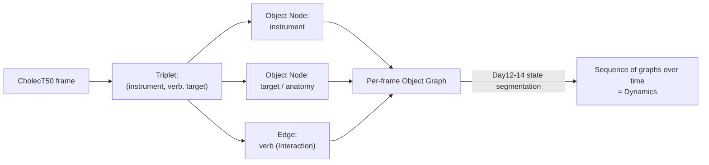
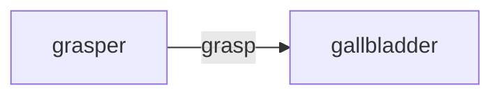
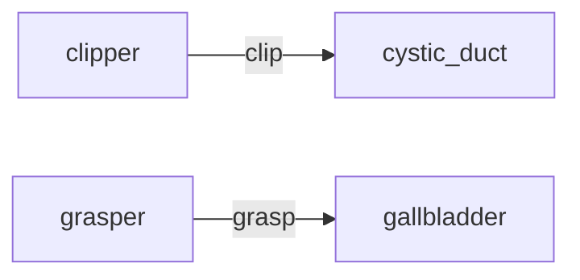
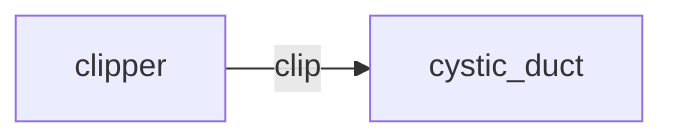
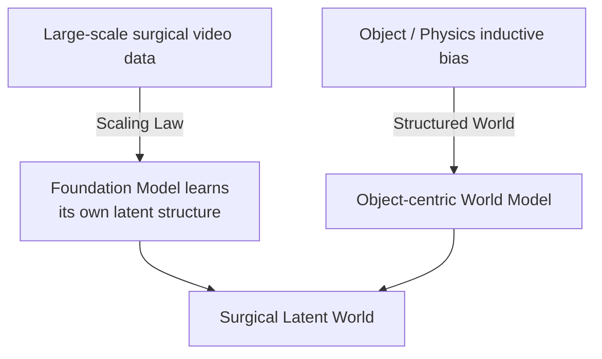

# Object-Centric World Models — Paper Exploration

This is a small side-track, separate from the 100-day CholecT50 challenge
(`day01_...` through `day14_...`). It exists to record understanding of a
paper read outside the main daily flow, without disrupting that flow. It
is a concept exploration, not a reproduction of the paper.

**Paper:** Vakhitov, Ugadiarov, Panov. *Object-Centric World Models Meet
Monte Carlo Tree Search.* arXiv:2601.06604 (2026).

---

## What the paper does

The paper proposes **ObjectZero**, a model-based reinforcement learning
algorithm. Instead of compressing an entire scene into one latent vector
(the typical World Model approach), it represents the scene as a graph:

- each **Object** in the scene is a **Node**
- the **Interaction** between two Objects is an **Edge**
- a Graph Neural Network (GNN) learns how this graph evolves over time
  (**Dynamics**)
- **Monte Carlo Tree Search (MCTS)** then plans actions by searching over
  predicted future graphs



---

## Why this is relevant to this project

CholecT50's own annotation, used throughout Day01-14, is already an
Object-centric representation, even though this project never framed it
that way until now: a triplet `(instrument, verb, target)` is exactly
`(Object) -[Interaction]-> (Object)`.



Day12-14 already built a version of "Dynamics" — states and transitions
between them — but only in a flattened, symbolic form (a state ID like
`S15`), not as an explicit Object graph. This exploration makes that
graph structure explicit for the first time.

---

## Demo: rendering a moment as an Object graph

`object_graph_demo.py` reuses the exact same frame-triplet and state
segmentation logic as Day12/13/14 (VID01, Jaccard threshold 0.6), picks
out the state right before, during, and after the cystic duct clipping
event, and renders each one as a small graph.

Run with:

```
python3 object_graph_demo.py
```

### Before clipping



### During clipping



### After clipping



Watching these three graphs in sequence is a toy version of "Dynamics":
the `clipper -> cystic_duct` edge appears, coexists briefly with the
ongoing `grasper -> gallbladder` edge, and then the graph simplifies once
clipping is underway. This is a direct, concrete instance of the paper's
Node/Edge/Dynamics idea, built entirely from data this project already
had — no GNN or MCTS involved.

---

## Scale vs Structure

This paper takes an explicit structural stance: give the model an
inductive bias (the world is made of Objects) rather than letting it
discover its own representation from scale alone. This is the same
tension raised in the Day33 LinkedIn post after reading a scaling-law
paper for surgical foundation models.



---

## Scope of this exploration

This does **not** implement ObjectZero's GNN, its learned Dynamics model,
or MCTS planning — that would be a substantial project on its own, and is
not what "evidence of understanding a paper" requires. The goal here was
narrower: show that the Node/Edge/Dynamics framing can be concretely
instantiated on data this project already has, and connect it explicitly
to the Day12-14 state work.

## Possible future directions (not started)

- Extend Day14's 1-step Markov chain into a shallow lookahead search over
  a few steps — a small, concrete step toward the "planning" half of this
  paper (MCTS), without needing a full GNN.
- Represent a frame's Object graph with more than instrument/target pairs
  — e.g. anatomical structures not currently in CholecT50's triplet
  vocabulary — echoing the Day14 reflection on what triplet labels cannot
  represent (bleeding, exposure, tension).
