# Genesis World — Playground

Small architecture-level playground, separate from the day-numbered
CholecT50 challenge (`day01_...` onward), in the same spirit as
`playground/object-centric-world-models` and `playground/neural-physics-engine`.
The design-philosophy discussion itself (Genesis as a Simulation
Platform vs. Dreamer as a World Model, the relevance of Rigid/Soft
Body/Cloth/Fluid to surgery) lives in the Day35 LinkedIn post; this
folder is a small piece of code to check that understanding by actually
running the library, not just reading its README.

**Library:** [`genesis-world`](https://pypi.org/project/genesis-world/)
1.2.1 (PyPI), run on CPU backend on an Apple M2.

## What's here

Three self-contained scripts, run inside a local `.venv` (Genesis needs
Python ≥3.10; the machine's default `python3` was 3.9, so this uses
`pyenv`'s 3.11.5):

- **`01_rigid_body_falling_sphere.py`** — the simplest possible scene: a
  Rigid Body sphere (radius 0.1) falls from z=1.0 onto a ground plane.
  Renders an offscreen camera to `falling_sphere.gif`.
- **`02_gravity_parameter_change.py`** — same scene, run twice with only
  `gravity` changed (Earth vs. Moon), to check that the simulation
  actually responds to the physics parameter rather than replaying a
  fixed animation.
- **`03_soft_body_elastic_cube.py`** — a Soft Body cube (`MPM.Elastic`,
  Material Point Method, 8,000 particles) dropped from z=0.8, softened
  to E=20,000 (default is 300,000) so the squash-and-bounce is visible.
  Renders to `soft_body_cube.gif`.

```
python3.11 -m venv .venv
source .venv/bin/activate
pip install genesis-world torch imageio
python 01_rigid_body_falling_sphere.py
```

## What it found

**Rigid Body vs. Soft Body, same drop, same ground:**

| | Rigid Body (sphere) | Soft Body (cube, `MPM.Elastic`) |
|---|---|---|
| 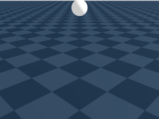 | falls, settles at z≈0.0996 (its own radius) and **stays perfectly still** | falls, **squashes** on impact (footprint 0.200→0.282), then **bounces** back up to z≈0.575 |
| 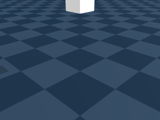 | | |

The sphere never bounces — the default Rigid material has zero
restitution, so contact just kills its velocity. The elastic cube does
the opposite: it stores energy while squashed and releases it as a
bounce. Same "drop it on the ground" setup, opposite outcome, purely
from swapping one `material=` argument.

**Gravity parameter check** (`02_gravity_parameter_change.py`): with
Earth gravity (-9.81) the sphere settles by step 48; with Moon gravity
(-1.62, about 1/6) it takes until step 106. The simulation responds to
the physical parameter in the expected direction and rough magnitude —
evidence this is an actual physics calculation, not a canned animation.

## Not in scope here (Day35)

No robot/articulated-body scenes, no Fluid or Cloth solver, no
Sim-to-Real transfer. This only checks that Rigid Body and Soft Body
behave differently under the same setup, and that changing one
parameter changes the outcome — the two claims the Day35 notes were
built on before touching any code.

## Day36: toward a pseudo surgical field

Day35 only ever dropped one object onto an open floor. Day36 asks a
different question: can Genesis pseudo-construct something like a
surgical field — a bounded cavity with multiple objects, some attached
to each other, some grasped? An initial plan of "change one Environment
parameter (gravity/friction/floor) at a time" turned out not to
actually build toward that; it only taught individual API knobs. The
plan pivoted to Genesis's official `examples/coupling/` and
`examples/collision/`, which combine different physics types on
purpose — much closer to what a surgical field actually is.

| # | Script | Surgical analogy | Physics concept | Result |
|---|---|---|---|---|
| 1 | `04_cloth_on_rigid.py` | Omentum draping over an organ | PBD Cloth, one-way Cloth-Rigid coupling | 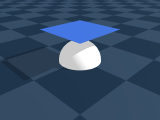 Cloth falls and drapes over a fixed sphere, no attachment point |
| 2 | `05_cloth_attached_adhesion.py` | Adhesion and its release | Partial constraint propagation through a deforming Cloth | 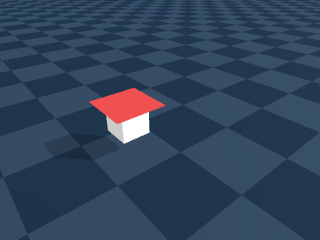 A few particles fixed to a moving box; rest of the cloth folds dynamically, falls free once released |
| 3 | `06_soft_body_tethered.py` | An organ held by a ligament/mesentery | Local constraint propagating through a deformable (MPM) body | 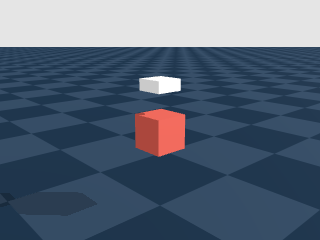 Only the top particles of an elastic cube are tethered to a moving rigid box; z-span stretches/compresses 0.13–0.17 as it's driven up and down |
| 4 | `08_multi_body_pile.py` | Multiple organs packed together | Multi-body contact, static friction | 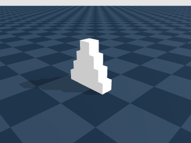 Boxes start mildly overlapping and jostle into a stable pile |
| 5 | `09_bounded_cavity.py` | The abdominal cavity itself | Boundary conditions constrain the reachable state space | 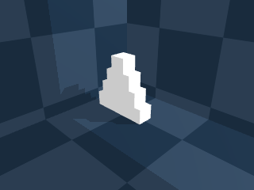 Same pile as #4, now boxed in by four walls; walls add no new force law, just narrow what configurations are possible |
| 6 | `07_grasp_soft_body_colab.ipynb` | An instrument grasping tissue | Contact-force grasping of a deformable body | 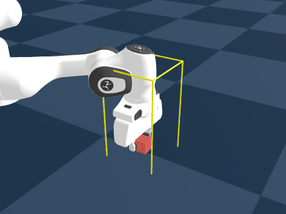 A Franka arm grips a soft MPM cube with 1N finger force and lifts it; the cube visibly dents where the fingers press in |

Scripts 1–5 ran locally on CPU (Apple M2) inside the same `.venv` as
Day35. Script 6 (Franka + IK control on a soft body) is heavy and
originally GPU-targeted in Genesis's own example, so it was run on
Google Colab's free T4 GPU instead — the notebook is checked in but not
runnable from this repo's local `.venv`.

**Honest caveat on #2:** the box was only meant to *carry* the adhered
cloth corner sideways, but `set_dofs_velocity` didn't sustain a
constant velocity across steps the way expected (or the cloth's own
tension pulled back quickly) — the box moved only ~0.03 in the
commanded direction instead of traversing the scene. The cloth's own
dynamic folding and the attach/release contrast are still visible, but
"the adhesion visibly drags the box" is not something this run
demonstrates.

**Where this leaves the surgical-field question:** these are six
separate, isolated mechanisms — draping, partial attachment, tethering,
crowding, confinement, grasping — each pseudo-modeling one piece of a
real surgical field, not one combined scene where all of them coexist
(one bounded cavity with several organs, some adhered, some grasped, at
once). Combining them is a natural next step but wasn't attempted here.

## Not in scope here (Day36)

No fluid solver (blood/irrigation), no photorealistic rendering (this
is purely mechanical — a rendering engine like Unreal would sit on top
of, not replace, this layer), no single scene combining all six
mechanisms at once.

## Day37: Fluid, and continuous emission (bleeding patterns)

Day36 flagged Fluid as unexplored. Day37 deliberately dropped the
surgical framing and just surveyed what Genesis's Fluid solver (SPH —
Smoothed Particle Hydrodynamics) can do, then used it to check whether
two clinically distinct bleeding patterns (arterial spurting vs. venous
oozing) could be told apart by physics parameters alone.

**Capability survey (no surgical framing):**

| # | Script | What it checks | Result |
|---|---|---|---|
| 1 | `10_fluid_sph_liquid.py` | Fluid alone | 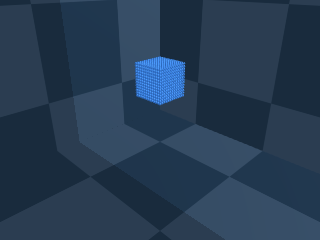 A dropped liquid block spreads into a thin, irregular puddle — behavior neither Rigid nor Soft Body produces |
| 2 | `11_fluid_sph_rigid_obstacle.py` | Fluid + Rigid coupling | 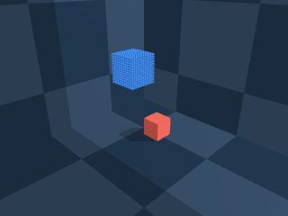 Liquid visibly flows around a fixed rigid box instead of overlapping it |
| 3 | `12_fluid_sph_mpm_soft.py` | Fluid + Soft Body coupling | 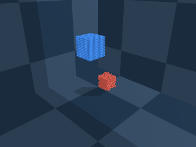 Liquid flows around a soft MPM block; unlike the rigid case, the block itself slumps and rounds off slightly |

**Bleeding patterns, using `scene.add_emitter()`:**

All three scripts above drop one static block of liquid. Genesis also
has an `Emitter` API (`scene.add_emitter()` + `emitter.emit(...)` called
every step) that injects a continuous stream of new particles with a
controllable speed and direction — closer to how a vessel actually
bleeds than a single dropped block.

| # | Script | Parameters | Result |
|---|---|---|---|
| 1 | `13_bleeding_arterial_spurt.py` | High speed (1.8–3.0 m/s), sine-wave pulsed (mimicking the cardiac cycle) | 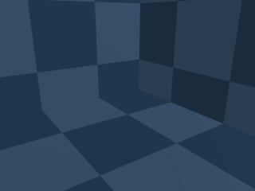 A forceful jet arcing across the basin — visually disturbing, in a good way for a training-data use case |
| 2 | `14_bleeding_venous_oozing.py` | Low, constant speed (0.12 m/s), straight down | 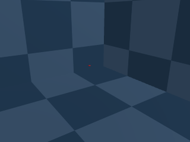 A slow dribble pooling near the source — no arc, no pulsation |

Getting the venous version to emit anything took one fix: at very low
speed, the emitter's default `droplet_length` (computed from
`speed × dt`) works out smaller than one particle, so it silently
accumulates for ~25 steps before emitting anything. Passing an explicit
`droplet_length` fixed it.

**Attempted and abandoned: pooling on an uneven surface.** A flat floor
makes oozing look like "liquid just wells up and spreads," with no
reason to accumulate anywhere. Real bleeding pools in whatever local
depression exists at the wound before overflowing into a channel. Two
approaches were tried to give the floor that structure:

1. A custom `gs.morphs.Terrain` heightfield (a crater + a winding
   groove). First attempt produced a jagged, wall-like mesh because the
   groove was carved by *cumulatively subtracting* many overlapping
   circular stamps along the path instead of taking their max envelope
   — overlapping stamps carved the same cells repeatedly. Fixed with a
   max-envelope + light smoothing pass.
2. After fixing the geometry, a **reproducible Genesis bug** surfaced:
   combining an `Emitter` with any additional Rigid entity in the scene
   (a Terrain, or even a single `Box`) causes most emitted particles to
   jump to the corners of the SPH solver's bounding domain instead of
   the requested nozzle position. Confirmed by isolating it down to the
   simplest case: `Plane + Emitter` alone works correctly;
   `Plane + one fixed Box + Emitter` reliably breaks. A static (non-
   emitter) liquid block coexisting with a Rigid obstacle (script 11,
   above) works fine — so the bug is specific to the `Emitter` + Rigid
   combination, not SPH-Rigid coupling in general.

This wasn't a performance ceiling (both attempts ran in seconds on
CPU) — it was a correctness bug in this version of the library
(`genesis-world` 1.2.1). No workaround was attempted beyond confirming
the isolation; the terrain scripts were not kept in this repo.

## Not in scope here (Day37)

No terrain/uneven-surface oozing (blocked by the bug above), no
granular material (sand/snow), no combining Fluid with the six Day36
mechanisms into one scene, no blood rheology (non-Newtonian behavior —
`rho`/`mu` were nudged toward blood's values but this is still a
Newtonian SPH fluid).

## Day38: combining five mechanisms into one scene (the Day35-38 capstone)

Day36 left six mechanisms as six separate scripts. Day38 closes that
out: `16_combined_surgical_field.py` combines five of them (grasping
simplified from a full Franka arm to two directly-driven rigid jaws,
to stay CPU-feasible) into one scene, framed as a laparoscopic
cholecystectomy moment — a gallbladder (Soft Body/MPM) tethered by a
fixed anchor (cystic duct/mesentery), sitting in a walled cavity next
to two crowding neighbor organs, with a Cloth patch (omentum) adhered
to a neighbor and draped over the organ, released partway through as
if just dissected, then grasped by two closing jaws.

**First two attempts failed, for two different reasons:**

1. Organ scattered into disconnected particles within ~20 steps
   (`dt=2e-2, substeps=10` — carried over unchanged from the Rigid/
   Cloth-only Day36 scripts).
2. Raising `substeps` to 40 at the same `dt` avoided the scatter but
   produced a new failure: `GenesisException: Invalid constraint
   forces causing 'nan'` from the Rigid solver, while the jaws were
   being driven via `set_pos()`.

**Root-caused instead of writing it off as "combining things is
hard":** three short, render-free isolation tests (organ+tether at the
coarse `dt`; organ+tether at Day36 script06's proven-stable
`dt=2e-3, substeps=20`; that same fine `dt` plus the teleporting jaws)
showed the coarse `dt` alone was enough to collapse the organ, and
that both the tether and the teleporting jaws were fine once `dt`
matched what MPM actually needed. Fixing `dt` (not stiffness, not the
jaw control method) made the full 5-mechanism scene run cleanly:

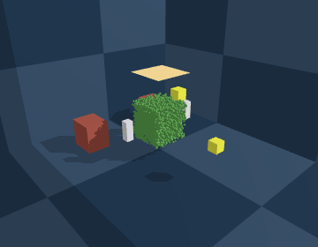

The organ stays cohesive throughout — visibly tethered, crowded by
neighbors, draped by cloth that releases from its adhesion point and
sags further onto the organ over time, jaws closing in at the end.

**Where this leaves the surgical-field question, honestly:** getting
diverse object types to coexist in one scene without solvers breaking
each other did work. But the shapes are boxes, there's no texture, and
each interaction (draping, tethering, grasping) is still a crude
approximation of the real mechanism. The main takeaway from Day38
wasn't "Genesis can now represent a surgical field" — it was a
concrete, hands-on sense of how large the gap is between "objects
coexist in one scene" and an actual faithful surgical world model, and
how much of that gap is unglamorous numerical plumbing (timestep
choice) rather than conceptual design.

## Not in scope here (Day38)

No Franka arm in the combined scene (simplified to two rigid jaws for
CPU feasibility), no Fluid in the combined scene (the Day37 Emitter+
Rigid bug would apply), no texture/material realism, no validation
that the chosen physical parameters (stiffness, `E`, friction) are
clinically meaningful — this closes the "can multiple mechanisms
coexist" question, not the "is this a faithful surgical simulation"
question.

This closes the Day35-38 Genesis arc.
